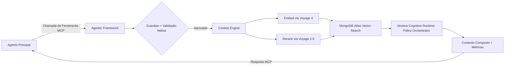



Agentes de IA tradicionais operam em **contextos fragmentados**, gerando alucinações, desperdiçando tokens e expondo segredos acidentalmente. O **Vectora** resolve isso não sendo "apenas mais um chat", mas sim um **[Sub-Agente de Tier 2](/concepts/sub-agents/)** projetado exclusivamente para engenharia de software: ele intercepta chamadas via [Protocolo MCP](/protocols/mcp/), valida a segurança em tempo real com o [Guardian](/security/guardian/), orquestra a recuperação em múltiplas etapas via [Context Engine](/concepts/context-engine/) e entrega contexto estruturado ao seu agente principal (Claude Code, Gemini CLI, Cursor, etc.).

> [!IMPORTANT] **Fórmula Central**: `Agente Funcional = Modelo (Gemini 3 Flash) + [Agentic Framework](/concepts/agentic-framework-runtime/) + Contexto Governado (Voyage 4 + MongoDB Atlas)`

## O Problema que o Vectora Resolve

A tabela abaixo descreve como o Vectora aborda as falhas comuns em agentes genéricos e seu impacto prático no desenvolvimento.

| Falha em Agentes Genéricos     | Impacto Prático                                                  | Como o Vectora Mitiga                                                                                                                                         |
| :----------------------------- | :--------------------------------------------------------------- | :------------------------------------------------------------------------------------------------------------------------------------------------------------ |
| **Contexto Raso**              | Busca por "autenticação" retorna 50 arquivos irrelevantes        | [Reranker 2.5](/concepts/reranker/) filtra por relevância semântica real, não apenas similaridade de cosseno bruta                                            |
| **Sem Validação Pré-Execução** | Chamadas de ferramentas perigosas rodam antes de serem auditadas | [Agentic Framework](/concepts/agentic-framework-runtime/) intercepta, valida via Struct Validation e aplica [Guardian](/security/guardian/) antes da execução |
| **Falta de Isolamento**        | Dados do projeto vazam entre sessões                             | [Isolamento de Namespace](/security/rbac/) via RBAC de nível de aplicação + filtragem obrigatória no backend                                                  |
| **Consumo Imprevisível**       | LLMs geram excesso de dados, desperdiçando tokens em boilerplate | [Context Engine](/concepts/context-engine/) decide o escopo, aplica compactação (head/tail) e injeta apenas o que é relevante                                 |
| **Segurança Frágil**           | Blocklists dependem de prompts (que podem sofrer jailbreak)      | [Hard-Coded Guardian](/security/guardian/) é compilado no binário Go, impossível de contornar via prompt                                                      |

## A Solução: Arquitetura de Sub-Agente

O Vectora é exposto **exclusivamente via MCP**. Não há CLI de chat, TUI ou interface conversacional direta. Ele opera silenciosamente como uma camada de governança e contexto.

## Componentes Principais

O sistema é dividido em módulos especializados que garantem a integridade e a performance da recuperação de contexto.

| Módulo                                                                              | Responsabilidade                                                                    | Documentação                                                               |
| :---------------------------------------------------------------------------------- | :---------------------------------------------------------------------------------- | :------------------------------------------------------------------------- |
| **[Vectora Cognitive Runtime (Decision Engine)](/models/vectora-decision-engine/)** | Cérebro tático: intercepta, roteia e observa o fluxo via inferência ONNX local      | Camada de decisão estruturada que orquestra a política do agente           |
| **[Agentic Framework](/concepts/agentic-framework-runtime/)**                       | Orquestra execução, valida esquemas, intercepta chamadas, persiste estado           | Infraestrutura que conecta a LLM ao mundo real, não um framework de testes |
| **[Context Engine](/concepts/context-engine/)**                                     | Decide o escopo (filesystem vs vector), aplica parsing AST, compactação multi-etapa | Pipeline `Embed → Search → Rerank → Compose → Validate`                    |
| **[Provider Router](/models/gemini/)**                                              | Roteia para a stack curada, gerencia fallback BYOK, rastreia cota                   | Sem camadas genéricas. SDKs oficiais, parsing estável                      |
| **[Tool Executor](/reference/mcp-tools/)**                                          | Valida argumentos via Tipagem Forte, executa com retry exponencial, sanitiza saída  | Blocklist imutável aplicada antes de qualquer chamada                      |

## Stack Curada e Infraestrutura

O Vectora **não é agnóstico a provedores**. Operamos com modelos rigorosamente calibrados para garantir consistência de métricas, estabilidade de parsing e custos previsíveis.

| Camada                    | Tecnologia                            | Por que escolhemos                                                           | Docs                                                          |
| :------------------------ | :------------------------------------ | :--------------------------------------------------------------------------- | :------------------------------------------------------------ |
| **Decisão (Tático)**      | `Vectora Cognitive Runtime (SmolLM2)` | Inferência local (<8ms), zero rede, decisões estruturadas e auditáveis       | [Vectora Cognitive Runtime](/models/vectora-decision-engine/) |
| **LLM (Inferência)**      | `gemini-3-flash`                      | Latência <30ms, chamadas de ferramentas estáveis, custo 90% menor que o Pro  | [Gemini 3](/models/gemini/)                                   |
| **Embeddings**            | `voyage-4`                            | Ciente de AST, captura similaridade funcional (`validateToken` ≈ `checkJWT`) | [Voyage 4](/models/voyage/)                                   |
| **Reranking**             | `voyage-rerank-2.5`                   | Cross-encoder otimizado para código, latência <100ms, +25% precisão vs BM25  | [Reranker](/concepts/reranker/)                               |
| **Vector DB + Metadados** | `MongoDB Atlas`                       | Backend unificado (vetores + docs + estado + auditoria), escalável, sem ETL  | [MongoDB Atlas](/backend/mongodb-atlas/)                      |

> [!WARNING] **Vectora Apenas Cloud**:
> O Vectora é uma solução 100% baseada em nuvem, otimizada para a stack Gemini + Voyage.
> **Não suportamos modelos locais (Ollama, LlamaCpp, etc.)** ou outros provedores genéricos para garantir a precisão do motor.

## Segurança, Governança e BYOK

A segurança no Vectora é implementada **na camada de aplicação**, não delegada ao banco de dados, garantindo controle total sobre o acesso aos dados.

| Camada                  | Implementação                                                                             | Documento                               |
| :---------------------- | :---------------------------------------------------------------------------------------- | :-------------------------------------- |
| **Hard-Coded Guardian** | Blocklist imutável (`.env`, `.key`, `.pem`, binários) executada antes de qualquer chamada | [Guardian](/security/guardian/)         |
| **Trust Folder**        | Validação de caminho com `fs.realpath` + escopo por namespace/projeto                     | [Trust Folder](/security/trust-folder/) |
| **RBAC de Aplicação**   | Papéis (`reader`, `contributor`, `admin`, `auditor`) validados em tempo de execução       | [RBAC](/security/rbac/)                 |
| **BYOK ou Gerenciado**  | Chaves do usuário (Free) ou créditos incluídos (Plus)                                     | [Plano Free](/plans/free/)              |
| **Gerenciado (Plus)**   | Cota gerenciada incluída nos planos Pro e Team                                            | [Plano Pro](/plans/pro/)                |

## Planos e Política de Retenção

O Vectora opera com um modelo de **Soberania Digital em Primeiro Lugar**, oferecendo **BYOK (Bring Your Own Key)** para controle total ou **Gerenciado (Plus)** para conveniência.

| Plano          | Preço       | Armazenamento            | Cota de API              | Retenção                                             | Docs                               |
| :------------- | :---------- | :----------------------- | :----------------------- | :--------------------------------------------------- | :--------------------------------- |
| **Free**       | $0/mês      | 512MB total              | Apenas BYOK              | 30 dias de inatividade = exclusão do índice vetorial | [Free](/plans/free/)               |
| **Pro**        | $29/mês     | 5GB total                | Ilimitado (Plus) ou BYOK | 90 dias pós-cancelamento                             | [Pro](/plans/pro/)                 |
| **Team**       | Customizado | Customizado              | Ilimitado (Plus) ou BYOK | Política de Conformidade                             | [Team](/plans/team/)               |
| **Enterprise** | Customizado | Ilimitado (VPC/Dedicado) | Por contrato             | Política customizada                                 | [Visão Geral](/plans/_index.pt.md) |

> [!NOTE] **Regras de Retenção**: Contas gratuitas inativas por 30 dias têm seu índice vetorial excluído automaticamente. Os metadados são preservados por +90 dias para exportação via `vectora export`. Downgrades notificam sobre a redução de limites e concedem 7 dias para backup. Detalhes em [Política de Retenção](/plans/retention/).

## Fluxo de Operação (MCP-First)

O processo de funcionamento do Vectora segue um fluxo rigoroso de validação e enriquecimento de contexto.

1. **Detecção**: O [Agente Principal](/integrations/claude-code/) identifica a necessidade de contexto profundo e dispara `context_search` via MCP.
2. **Interceptação**: O [Agentic Framework](/concepts/agentic-framework-runtime/) captura a chamada, valida o namespace e aplica o [Guardian](/security/guardian/).
3. **Decisão Tática (Vectora Cognitive Runtime)**: O [Vectora Cognitive Runtime](/models/vectora-decision-engine/) intercepta a intenção e decide a política de roteamento em <8ms (local).
4. **Recuperação**: O [Context Engine](/concepts/context-engine/) escolhe o escopo (filesystem, vetor ou híbrido) e aplica parsing AST.
5. **Embed + Rerank**: A consulta é processada via `voyage-4` e os resultados brutos são refinados pelo `voyage-rerank-2.5`.
6. **Busca e Compactação**: O [MongoDB Atlas](/backend/mongodb-atlas/) retorna os top-N com compactação (head/tail + ponteiros) para evitar a degradação do contexto.
7. **Observação (Vectora Cognitive Runtime)**: O Vectora Cognitive Runtime valida a resposta final contra o contexto original para garantir zero alucinações.
8. **Resposta Estruturada**: Contexto validado + métricas são retornados ao agente principal, que gera a resposta final ao usuário.

## Por onde começar?

Explore os guias abaixo para entender como integrar e operar o Vectora no seu dia a dia.

| Categoria             | Documento                                                                                                                   | Descrição                                                                             |
| :-------------------- | :-------------------------------------------------------------------------------------------------------------------------- | :------------------------------------------------------------------------------------ |
| **Início Rápido**     | [Primeiros Passos](/getting-started/)                                                                                       | `winget install kaffyn.vectora`, setup da Systray, integração MCP                     |
| **Conceitos**         | [Sub-Agentes](/concepts/sub-agents/)                                                                                        | Por que Sub-Agente e não ferramentas MCP passivas? Governança ativa                   |
| **Agentic Framework** | [Agentic Framework](/concepts/agentic-framework-runtime/)                                                                   | Execução de ferramentas, Engenharia de Contexto, Gestão de Estado                     |
| **Contexto & RAG**    | [Context Engine](/concepts/context-engine/)                                                                                 | Parsing AST, compactação, raciocínio multi-etapa, ranking híbrido                     |
| **Reranking**         | [Reranker](/concepts/reranker/) · [Reranker Local](/concepts/reranker-local/)                                               | VectorDB + cross-encoder para dados mutáveis, trade-offs de custo                     |
| **Modelos**           | [Gemini 3](/models/gemini/) · [Voyage 4](/models/voyage/)                                                                   | Stack curada, fallback BYOK, esquema de config, custos por query                      |
| **Backend**           | [MongoDB Atlas](/backend/mongodb-atlas/)                                                                                    | Busca Vetorial, coleções, persistência de estado, isolamento multi-tenant             |
| **Segurança**         | [Guardian](/security/guardian/) · [RBAC](/security/rbac/)                                                                   | Blocklist hard-coded, Trust Folder, sanitização, papéis por namespace                 |
| **Planos**            | [Visão Geral](/plans/overview/)                                                                                             | Free/Pro/Team, cota gerenciada, fallback automático, política de retenção             |
| **Integrações**       | [Claude Code](/integrations/claude-code/) · [Gemini CLI](/integrations/gemini-cli/) · [Paperclip](/integrations/paperclip/) | Configuração MCP, extensões de IDE, agentes customizados, orquestradores multi-agente |
| **Referência**        | [Ferramentas MCP](/reference/mcp-tools/) · [Config YAML](/reference/config-yaml/)                                           | Schema de ferramentas, config.yaml validado nativamente, códigos de erro              |
| **Contribuição**      | [Diretrizes](/contributing/guidelines/)                                                                                     | Golang estrito, testes de performance, PRs, roadmap público                           |

---

> **Frase para lembrar**:
> _"O Vectora não responde ao usuário. Ele entrega contexto governado ao seu agente. Backend gerenciado, API sob sua chave, segurança na aplicação, seus dados sempre seus."_

## Guia de Navegação

Acesse as seções principais da documentação para aprofundar seu conhecimento.

- [**Primeiros Passos**](./getting-started/) — Instalação, setup BYOK e integração MCP.
- [**Conceitos Centrais**](./concepts/) — Entenda Sub-Agentes, Context Engine e Reranking.
- [**Segurança e Governança**](./security/) — Detalhes sobre Guardian, Trust Folder e RBAC.
- [**Autenticação**](./auth/) — Fluxos SSO, Identidade Unificada e Chaves de API.
- [**Modelos e Provedores**](./models/) — Stack curada com Gemini 3 e Voyage AI.
- [**Backend**](./backend/) — MongoDB Atlas.
- [**Integrações**](./integrations/) — Como usar com Claude Code, Gemini CLI e Cursor.
- [**Planos e Preços**](./plans/) — Comparação de funcionalidades e política de retenção.
- [**Referência Técnica**](./reference/) — Schema de ferramentas MCP e Config YAML.
- [**Contribuição**](./contributing/) — Diretrizes, padrões de código e roadmap.
- [**FAQ**](./faq/) — Resolução de problemas e perguntas frequentes.
- [**Protocolos**](./protocols/) — Especificações do Protocolo MCP no Vectora.

## External Linking

| Concept               | Resource                             | Link                                                                                                       |
| --------------------- | ------------------------------------ | ---------------------------------------------------------------------------------------------------------- |
| **MongoDB Atlas**     | Atlas Vector Search Documentation    | [www.mongodb.com/docs/atlas/atlas-vector-search/](https://www.mongodb.com/docs/atlas/atlas-vector-search/) |
| **MCP**               | Model Context Protocol Specification | [modelcontextprotocol.io/specification](https://modelcontextprotocol.io/specification)                     |
| **MCP Go SDK**        | Go SDK for MCP (mark3labs)           | [github.com/mark3labs/mcp-go](https://github.com/mark3labs/mcp-go)                                         |
| **Voyage AI**         | High-performance embeddings for RAG  | [www.voyageai.com/](https://www.voyageai.com/)                                                             |
| **Voyage Embeddings** | Voyage Embeddings Documentation      | [docs.voyageai.com/docs/embeddings](https://docs.voyageai.com/docs/embeddings)                             |
| **Voyage Reranker**   | Voyage Reranker API                  | [docs.voyageai.com/docs/reranker](https://docs.voyageai.com/docs/reranker)                                 |

---

**Vectora v0.1.0** · [GitHub](https://github.com/Kaffyn/Vectora) · [Licença (MIT)](https://github.com/Kaffyn/Vectora/blob/master/LICENSE) · [Contribuidores](https://github.com/Kaffyn/Vectora/graphs/contributors)

_Parte do ecossistema de Agentes de IA Vectora. Construído com [ADK](https://adk.dev/), [Claude](https://claude.ai/) e [Go](https://golang.org/)._

© 2026 Vectora Contributors. Todos os direitos reservados.

---

_Parte do ecossistema Vectora_ · [Open Source (MIT)](https://github.com/Kaffyn/Vectora) · [Contribuidores](https://github.com/Kaffyn/Vectora/graphs/contributors)
