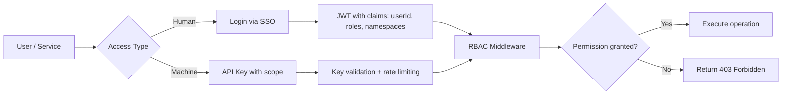



Vectora's authentication layer ensures that only authorized users and services can access resources, namespaces, and sensitive operations. This section documents the identity mechanisms, API key management, and access control that protect your context infrastructure.

## Authentication and Authorization in Vectora

Security is treated as an absolute priority, utilizing multiple layers of protection.

> [!IMPORTANT] **Security in the application, not the database**: Vectora implements RBAC, namespace validation, and sanitization in the application layer (`Guardian`, `RBAC Logic`). The backend (MongoDB Atlas) stores data; the application decides who can access what.

## Topics in this section

Explore the detailed guides on each available authentication method.

| Page                                 | Description                                                                                                    |
| :----------------------------------- | :------------------------------------------------------------------------------------------------------------- |
| [SSO / Unified Identity](/auth/sso/) | Centralized authentication, session management, and integration with external providers (GitHub, Google, SAML) |
| [API Keys](/auth/api-keys/)          | Creation, rotation, and scoping of API keys for programmatic integration with Vectora                          |

## Typical Authentication Flow

The flowchart below illustrates how the system differentiates and processes user and service access.



## Fundamental Concepts

Understanding these terms is essential for correctly configuring your environment's security.

| Term             | Definition                                                                                  |
| :--------------- | :------------------------------------------------------------------------------------------ |
| **Namespace**    | Logical isolation of data and operations; each project/team has its own namespace           |
| **RBAC**         | Role-Based Access Control: roles like `reader`, `contributor`, `admin` define permissions   |
| **API Key**      | Access token for programmatic integration, with granular scopes (`read`, `write`, `search`) |
| **JWT**          | Signed JSON Web Token carrying identity and permission claims                               |
| **Trust Folder** | Allowed filesystem scope for operations; validated before any tool call                     |

## Security Best Practices

Follow these recommendations to keep your context infrastructure protected.

1. **Use scoped API Keys**: Grant only `search` or `read` if the integration doesn't need to write.
2. **Rotate keys periodically**: Renew API Keys every 90 days or after any security incident.
3. **Validate namespaces in every call**: Don't just trust the token; revalidate scope at runtime.
4. **Monitor audit logs**: Use `audit_logs` to detect anomalous access patterns.
5. **Never expose keys in the client**: API Keys belong to the backend or the principal agent, never the browser.

> [!WARNING] **Hard-coded blocklist**: Files like `.env`, `.key`, and `.pem` are blocked by the `Guardian` before any processing — regardless of authentication. Security by code, not by configuration.

## Integration with Your System

Below are practical examples of how to implement authentication in your own ecosystem.

### Example: JWT Validation in your backend

```ts
import { verifyJWT } from "@vectora/auth";

export async function authMiddleware(req: Request, next: Handler) {
  const token = req.headers.get("Authorization")?.replace("Bearer ", "");
  if (!token) return next({ status: 401, error: "Missing token" });

  try {
    const claims = await verifyJWT(token, { audience: "vectora-api" });
    req.context = {
      userId: claims.sub,
      roles: claims.roles,
      namespaces: claims.namespaces,
    };
    return next();
  } catch {
    return next({ status: 403, error: "Invalid token" });
  }
}
```

### Example: Using an API Key in an MCP call

```json
{
  "mcpServers": {
    "vectora": {
      "command": "npx",
      "args": ["@kaffyn/vectora", "mcp-serve"],
      "env": {
        "VECTORA_API_KEY": "vca_live_...",
        "VECTORA_NAMESPACE": "my-project"
      }
    }
  }
}
```

## Frequently Asked Questions

Answers to the most common questions about security and access.

**Q: Do I need SSO to use Vectora?**
A: No. The Free plan uses local authentication via `vectora auth login`. SSO is available on Pro/Team plans for integration with corporate providers.

**Q: Can I use my own auth infrastructure?**
A: Yes. Vectora accepts any valid JWT configured via `auth.jwt.publicKey`. Consult [SSO](/auth/sso/) for custom integration details.

**Q: How do I revoke a compromised API Key?**
A: Via the dashboard (`/settings/api-keys`) or CLI: `vectora api-key revoke --id <key_id>`. Revocation is immediate across all nodes.

## External Linking

| Concept           | Resource                                   | Link                                                                                                       |
| ----------------- | ------------------------------------------ | ---------------------------------------------------------------------------------------------------------- |
| **MongoDB Atlas** | Atlas Vector Search Documentation          | [www.mongodb.com/docs/atlas/atlas-vector-search/](https://www.mongodb.com/docs/atlas/atlas-vector-search/) |
| **MCP**           | Model Context Protocol Specification       | [modelcontextprotocol.io/specification](https://modelcontextprotocol.io/specification)                     |
| **MCP Go SDK**    | Go SDK for MCP (mark3labs)                 | [github.com/mark3labs/mcp-go](https://github.com/mark3labs/mcp-go)                                         |
| **JWT**           | RFC 7519: JSON Web Token Standard          | [datatracker.ietf.org/doc/html/rfc7519](https://datatracker.ietf.org/doc/html/rfc7519)                     |
| **RBAC**          | NIST Role-Based Access Control Standard    | [csrc.nist.gov/projects/rbac](https://csrc.nist.gov/projects/rbac)                                         |
| **WebAuthn**      | Web Authentication: Public Key Credentials | [www.w3.org/TR/webauthn-2/](https://www.w3.org/TR/webauthn-2/)                                             |

---

_Part of the Vectora ecosystem_ · [Open Source (MIT)](https://github.com/Kaffyn/Vectora) · [Contributors](https://github.com/Kaffyn/Vectora/graphs/contributors)
