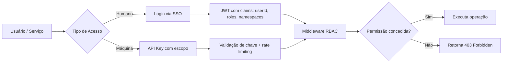



A camada de autenticação do Vectora garante que apenas usuários e serviços autorizados acessem recursos, namespaces e operações sensíveis. Esta seção documenta os mecanismos de identidade, gestão de chaves de API e controle de acesso que protegem sua infraestrutura de contexto.

## Autenticação e Autorização no Vectora

A segurança é tratada como uma prioridade absoluta, utilizando múltiplas camadas de proteção.

> [!IMPORTANT] **Segurança na aplicação, não no banco**: O Vectora implementa RBAC, validação de namespace e sanitização na camada de aplicação (`Guardian`, `RBAC Logic`). O backend (MongoDB Atlas) armazena dados; a aplicação decide quem pode acessar o quê.

## Tópicos desta seção

Explore os guias detalhados sobre cada método de autenticação disponível.

| Página                                   | Descrição                                                                                                |
| :--------------------------------------- | :------------------------------------------------------------------------------------------------------- |
| [SSO / Identidade Unificada](/auth/sso/) | Autenticação centralizada, gestão de sessões e integração com provedores externos (GitHub, Google, SAML) |
| [API Keys](/auth/api-keys/)              | Criação, rotação e escopos de chaves de API para integração programática com o Vectora                   |

## Fluxo de Autenticação Típico

O fluxograma abaixo ilustra como o sistema diferencia e processa acessos de usuários e serviços.



## Conceitos Fundamentais

Entender esses termos é essencial para configurar corretamente a segurança do seu ambiente.

| Termo            | Definição                                                                                        |
| :--------------- | :----------------------------------------------------------------------------------------------- |
| **Namespace**    | Isolamento lógico de dados e operações; cada projeto/time tem seu namespace                      |
| **RBAC**         | Role-Based Access Control: roles como `reader`, `contributor`, `admin` definem permissões        |
| **API Key**      | Token de acesso para integração programática, com escopos granulares (`read`, `write`, `search`) |
| **JWT**          | JSON Web Token assinado que carrega claims de identidade e permissões                            |
| **Trust Folder** | Escopo de filesystem permitido para operações; validado antes de qualquer tool call              |

## Boas Práticas de Segurança

Siga estas recomendações para manter sua infraestrutura de contexto protegida.

1. **Use API Keys com escopo mínimo**: Conceda apenas `read` se a integração não precisa escrever.
2. **Rotação periódica de chaves**: Renove API Keys a cada 90 dias ou após incidentes.
3. **Valide namespaces em cada chamada**: Não confie apenas no token; revalide escopo no runtime.
4. **Monitore logs de auditoria**: Use `audit_logs` para detectar acessos anômalos.
5. **Nunca exponha chaves no client**: API Keys pertencem ao backend ou ao agent principal, nunca ao browser.

> [!WARNING] **Blocklist hard-coded**: Arquivos como `.env`, `.key`, `.pem` são bloqueados pelo `Guardian` antes de qualquer processamento — independente de autenticação. Segurança por código, não por configuração.

## Integração com Seu Sistema

Abaixo estão exemplos práticos de como implementar a autenticação no seu próprio ecossistema.

### Exemplo: Validação de JWT no seu backend

```ts
import { verifyJWT } from "@vectora/auth";

export async function authMiddleware(req: Request, next: Handler) {
  const token = req.headers.get("Authorization")?.replace("Bearer ", "");
  if (!token) return next({ status: 401, error: "Missing token" });

  try {
    const claims = await verifyJWT(token, { audience: "vectora-api" });
    req.context = {
      userId: claims.sub,
      roles: claims.roles,
      namespaces: claims.namespaces,
    };
    return next();
  } catch {
    return next({ status: 403, error: "Invalid token" });
  }
}
```

### Exemplo: Uso de API Key em chamada MCP

```json
{
  "mcpServers": {
    "vectora": {
      "command": "npx",
      "args": ["vectora-agent", "mcp-serve"],
      "env": {
        "VECTORA_API_KEY": "vca_live_...",
        "VECTORA_NAMESPACE": "my-project"
      }
    }
  }
}
```

## Perguntas Frequentes

Respostas para as dúvidas mais comuns sobre segurança e acesso.

**P: Preciso de SSO para usar o Vectora?**
R: Não. O plano Free usa autenticação local via `vectora auth login`. SSO é disponível nos planos Pro/Team para integração com provedores corporativos.

**P: Posso usar minha própria infraestrutura de auth?**
R: Sim. O Vectora aceita qualquer JWT válido configurado via `auth.jwt.publicKey`. Consulte [SSO](/auth/sso/) para detalhes de integração customizada.

**P: Como revogo uma API Key comprometida?**
R: Via dashboard (`/settings/api-keys`) ou CLI: `vectora api-key revoke --id <key_id>`. A revogação é imediata em todos os nós.

## External Linking

| Concept           | Resource                                   | Link                                                                                                       |
| ----------------- | ------------------------------------------ | ---------------------------------------------------------------------------------------------------------- |
| **MongoDB Atlas** | Atlas Vector Search Documentation          | [www.mongodb.com/docs/atlas/atlas-vector-search/](https://www.mongodb.com/docs/atlas/atlas-vector-search/) |
| **MCP**           | Model Context Protocol Specification       | [modelcontextprotocol.io/specification](https://modelcontextprotocol.io/specification)                     |
| **MCP Go SDK**    | Go SDK for MCP (mark3labs)                 | [github.com/mark3labs/mcp-go](https://github.com/mark3labs/mcp-go)                                         |
| **JWT**           | RFC 7519: JSON Web Token Standard          | [datatracker.ietf.org/doc/html/rfc7519](https://datatracker.ietf.org/doc/html/rfc7519)                     |
| **RBAC**          | NIST Role-Based Access Control Standard    | [csrc.nist.gov/projects/rbac](https://csrc.nist.gov/projects/rbac)                                         |
| **WebAuthn**      | Web Authentication: Public Key Credentials | [www.w3.org/TR/webauthn-2/](https://www.w3.org/TR/webauthn-2/)                                             |

---

_Parte do ecossistema Vectora_ · [Open Source (MIT)](https://github.com/Kaffyn/Vectora) · [Contribuidores](https://github.com/Kaffyn/Vectora/graphs/contributors)
