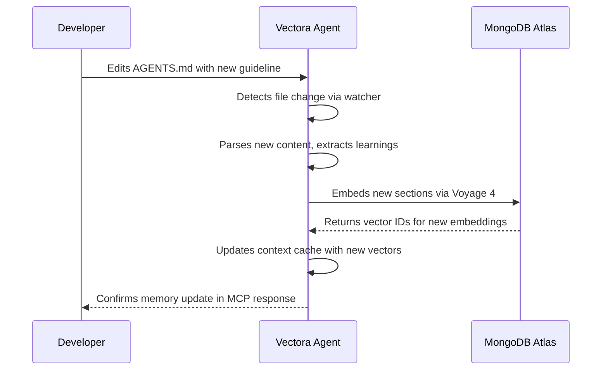



Vectora's state persistence layer ensures that agents maintain continuity between interactions, enabling long-term tasks, incremental learning, and contextual awareness that survives IDE restarts, MCP disconnections, and system reboots.

Unlike traditional RAG systems that treat each query as independent, Vectora treats state as an absolute priority: what the agent learned yesterday informs what it does today.

## Maintaining Context Between Sessions

The persistence system tracks the evolution of the agent's knowledge and the current execution state of various tasks.

## Architecture Overview

State in Vectora is managed through three complementary mechanisms:

```mermaid
graph TD
    A[MCP Session] --> Vectora Cognitive Runtime[Vectora Cognitive Runtime: Tactical Brain]
    Vectora Cognitive Runtime --> B[Operational State]
    Vectora Cognitive Runtime --> C[Memory Layer]
    Vectora Cognitive Runtime --> D[Audit Trail]

    B --> E[MongoDB Atlas: sessions collection]
    C --> F[AGENTS.md + Vector Embeddings]
    D --> G[MongoDB Atlas: audit_logs collection]

    E --> H[Working memory: current plan, tool history, context cache]
    F --> I[Long-term memory: learned patterns, preferences, project knowledge]
    G --> J[Compliance: who did what, when, and why]
```

The **[Vectora Cognitive Runtime (Decision Engine)](/models/vectora-decision-engine/)** orchestrates how and when state is persisted, ensuring that only tactically relevant information is consolidated into long-term memory.

## Operational State (sessions collection)

Short-lived state that tracks the current execution context:

| Field           | Type      | Description                                                      |
| :-------------- | :-------- | :--------------------------------------------------------------- |
| `session_id`    | string    | Unique identifier for the MCP session                            |
| `user_id`       | string    | Authenticated user via Kaffyn SSO                                |
| `namespace`     | string    | Isolated project/workspace context                               |
| `current_plan`  | object    | Active execution plan with steps and dependencies                |
| `tool_history`  | array     | Sequence of tool calls with inputs, outputs, and timing          |
| `context_cache` | object    | Pre-fetched embeddings, analyzed ASTs, and resolved dependencies |
| `created_at`    | timestamp | Session start time                                               |
| `last_activity` | timestamp | Last MCP interaction (used for TTL cleanup)                      |

## Memory Layer (AGENTS.md + embeddings)

Long-term knowledge that persists beyond individual sessions:

- **AGENTS.md**: Human-readable memory file stored in the project root, containing learned patterns, preferences, and project-specific guidelines.
- **Vector embeddings**: Semantic representation of AGENTS.md content indexed in MongoDB Atlas for retrieval during context building.
- **Incremental updates**: New learnings are appended to AGENTS.md and re-embedded without re-indexing the entire file.

## Audit Trail (audit_logs collection)

Immutable records of agent actions for compliance and debugging:

| Field             | Type      | Description                                              |
| :---------------- | :-------- | :------------------------------------------------------- |
| `log_id`          | string    | Unique audit record identifier                           |
| `session_id`      | string    | Reference to originating session                         |
| `action`          | string    | Tool name or system event                                |
| `input_hash`      | string    | SHA-256 of tool arguments (never stores raw secrets)     |
| `output_metadata` | object    | Non-sensitive result metadata (status, duration, tokens) |
| `security_flags`  | array     | Guardian validations, blocklist checks, sanitization     |
| `timestamp`       | timestamp | Precise event time with millisecond resolution           |

## Session Lifecycle Management

Managing a session's lifecycle ensures that resources are allocated efficiently and cleaned up when no longer needed.

## Session Creation

When an MCP client connects, the system follows a specific sequence to establish a secure and contextual environment:

1. Vectora validates the Kaffyn SSO JWT.
2. Checks for existing active sessions for this `user_id` + `namespace`.
3. Creates a new session document with default `current_plan` structure.
4. Loads AGENTS.md, if present, and updates the context cache.
5. Returns the `session_id` to the client for subsequent requests.

## Session Continuity

For ongoing interactions, the system maintains the link between the client and the stored state:

1. The client includes the `session_id` in the MCP request headers.
2. Vectora loads the operational state from MongoDB Atlas.
3. Updates the `last_activity` timestamp to prevent TTL cleanup.
4. Executes the tool call with full context awareness.
5. Persists the updated state before responding.

## Session Cleanup

Automatic maintenance via MongoDB TTL indexes ensures that the database does not grow indefinitely:

```yaml
sessions:
  ttl_field: "last_activity"
  ttl_seconds: 86400 # 24 hours of inactivity

audit_logs:
  ttl_field: "timestamp"
  ttl_seconds: 7776000 # 90 days retention (configurable by plan)
```

Manual cleanup via CLI provides more granular control over state management:

```bash
# Delete expired sessions for a namespace
vectora state cleanup --namespace my-project --dry-run

# Force delete a specific session
vectora state delete --session-id sess_abc123

# Export session state before deletion
vectora state export --session-id sess_abc123 --output ./backup.json
```

## AGENTS.md: Human-Machine Memory Interface

AGENTS.md serves as the bridge between human understanding and agent memory:

## Structure and Organization

The AGENTS.md file structure was designed to be easily readable by both developers and AI agents:

```markdown
# Project Memory: my-project

## Learned Patterns

- Authentication flows use JWT with 1-hour expiration
- Database connections use connection pooling with max 10 connections
- Error handling follows the Result<T, E> pattern

## Preferences

- Prefer functional composition over class inheritance
- Use TypeScript strict mode for all new files
- Log levels: debug for development, info for production

## Project Guidelines

- All API endpoints must include OpenAPI annotations
- Tests must achieve 80% branch coverage
- Security reviews required for any auth-related changes
```

## Integration Workflow

The following diagram illustrates how AGENTS.md changes are propagated through the system:



## Security Considerations

Security is a primary concern for the state persistence layer, with multiple safeguards in place:

- AGENTS.md is subject to the same Guardian blocklist as other files: `.env`, `.key`, `.pem` patterns are never embedded.
- Sensitive content detected via regex is redacted before embedding.
- Namespace isolation ensures AGENTS.md from one project never influences another.

## Agentic Framework Integration: Validating State Management

The Agentic Framework includes specific tests for state persistence to ensure reliability:

```yaml
# tests/state/session-continuity.yaml
id: "state-session-continuity"
name: "Agent maintains plan despite MCP disconnections"

task:
  prompt: "Continue refactoring the auth module where we left off"
  session_id: "${PREVIOUS_SESSION_ID}"

context:
  providers: [vectora]
  namespace: auth-service
  load_agents_md: true

expectations:
  state:
    plan_resumed: true
    tool_history_preserved: true
    context_cache_reused: true
  output:
    references_previous_steps: true
    avoids_redundant_work: true

evaluation:
  judge_config: { method: "hybrid", judge_model: "gemini-3-flash" }
  scoring:
    weights: { correctness: 0.40, performance: 0.30, maintainability: 0.30 }
  thresholds: { pass_score: 0.75 }
```

## Configuration Reference

Configuration of the state layer allows for fine-tuning the balance between persistence and performance.

## vectora.config.yaml

The following settings control how the state layer behaves globally:

```yaml
state:
  # Session management
  session:
    ttl_hours: 24 # Inactivity timeout before cleanup
    max_concurrent: 5 # Limit sessions per user/namespace
    persist_on_exit: true # Save state when MCP connection closes

  # Memory layer
  memory:
    agents_file: "AGENTS.md" # Path relative to project root
    auto_update: true # Automatically embed new AGENTS.md content
    embedding_model: "voyage-4" # Model for memory embeddings
    max_memory_tokens: 4096 # Limit context injected from memory

  # Audit settings
  audit:
    enabled: true
    retain_days: 90 # Retention period for audit logs
    redact_patterns: # Additional regex patterns to redact
      - "password\\s*[:=]\\s*['\"]?[^'\"\\s]+"
      - "api[_-]?key\\s*[:=]\\s*['\"]?[^'\"\\s]+"

  # Backend connection (managed by Kaffyn)
  mongodb:
    database: "vectora"
    collections:
      sessions: "sessions"
      audit: "audit_logs"
      memory_vectors: "memory_embeddings"
```

## Performance Optimizations

Optimizing state operations is crucial for maintaining a responsive agent experience.

## Context Cache Strategy

To minimize latency during session continuation, Vectora employs several caching techniques:

- **LRU eviction**: Keep most recently accessed embeddings in memory.
- **Prefetching**: Load likely-needed context based on current plan step.
- **Delta updates**: Only re-embed changed sections of AGENTS.md, not the entire file.

## Batch Operations

MongoDB operations are batched for efficiency and to maximize throughput:

```typescript
// packages/core/src/state/batch-operations.ts
export async function updateSessionState(sessionId: string, updates: StateUpdate[]): Promise<void> {
  // Group updates by collection for bulk operations
  const byCollection = groupByCollection(updates);

  // Execute bulk writes with ordered=false for parallelism
  await Promise.all(
    Object.entries(byCollection).map(([collection, ops]) =>
      mongodb.collection(collection).bulkWrite(ops, { ordered: false }),
    ),
  );
}
```

## Troubleshooting

Resolving issues with state persistence often involves checking connectivity and quotas.

## Session Not Found

If a session is reported as not found, consider the following possibilities:

```text
Error: Session sess_abc123 not found for namespace auth-service
```

Possible causes:

- Session expired due to TTL cleanup (check `last_activity` timestamp).
- Namespace mismatch between client request and stored session.
- MongoDB Atlas connectivity issue.

Resolution:

```bash
# Verify session exists
vectora state list --namespace auth-service

# Check MongoDB connectivity
vectora health check --component mongodb

# Reconnect with a new session
vectora auth refresh
```

## AGENTS.md Not Updating Memory

When changes to AGENTS.md are detected but not reflected in the agent's memory:

```text
Warning: AGENTS.md changes detected but memory not updated
```

Possible causes:

- Embedding quota exhausted (check plan limits).
- Guardian blocklist prevented embedding of new content.
- Voyage API temporarily unavailable.

Resolution:

```bash
# Check embedding quota status
vectora quota status --component embeddings

# Manually trigger memory update
vectora memory sync --file AGENTS.md

# Review Guardian logs for blocked content
vectora logs --filter guardian --namespace auth-service
```

## Audit Logs with Missing Entries

If expected audit records are missing from the logs:

```text
Warning: Expected audit entry for tool_call not found
```

Possible causes:

- Audit logging disabled in configuration.
- MongoDB write concern not met (network issue).
- Session cleanup deleted related audit records prematurely.

Resolution:

```bash
# Verify audit configuration
vectora config get state.audit.enabled

# Check MongoDB write operations
vectora health check --component mongodb --verbose

# Review TTL settings for audit_logs collection
vectora config get state.audit.retain_days
```

## Frequently Asked Questions (FAQ)

Common questions about state persistence and memory management:

**Q: Can I disable state persistence for privacy-sensitive projects?**
A: Yes. Set `state.session.persist_on_exit: false` and `state.audit.enabled: false` in vectora.config.yaml. Note that this disables session continuity and compliance logging.

**Q: How is AGENTS.md different from regular project documentation?**
A: AGENTS.md is specifically parsed and embedded for agent memory. Regular documentation files are indexed via standard RAG pipeline. AGENTS.md content receives higher priority during context building.

**Q: What happens to state when I move from Pro to Free?**
A: Sessions and audit logs are retained for 90 days per retention policy. If your usage exceeds Free tier limits, new state writes will be blocked until you upgrade or free up space. Existing data remains accessible for export.

**Q: Can multiple agents share the same AGENTS.md?**
A: Yes, within the same namespace. AGENTS.md is project-scoped, not user-scoped. All agents operating in the "auth-service" namespace will see the same memory file. Use separate namespaces for isolation.

**Q: How do I migrate state between MongoDB Atlas regions?**
A: Use the export/import workflow:

```bash
# Export from source region
vectora state export --namespace my-project --output ./state-backup.json

# Import to target region
vectora state import --namespace my-project --input ./state-backup.json --region us-east-1
```

Phrase to remember:
"State persistence turns isolated queries into continuous collaboration. Operational state tracks the now, memory preserves the learned, and audit ensures accountability."

## External Linking

| Concept               | Resource                             | Link                                                                                                       |
| --------------------- | ------------------------------------ | ---------------------------------------------------------------------------------------------------------- |
| **MongoDB Atlas**     | Atlas Vector Search Documentation    | [www.mongodb.com/docs/atlas/atlas-vector-search/](https://www.mongodb.com/docs/atlas/atlas-vector-search/) |
| **MCP**               | Model Context Protocol Specification | [modelcontextprotocol.io/specification](https://modelcontextprotocol.io/specification)                     |
| **MCP Go SDK**        | Go SDK for MCP (mark3labs)           | [github.com/mark3labs/mcp-go](https://github.com/mark3labs/mcp-go)                                         |
| **Voyage AI**         | High-performance embeddings for RAG  | [www.voyageai.com/](https://www.voyageai.com/)                                                             |
| **Voyage Embeddings** | Voyage Embeddings Documentation      | [docs.voyageai.com/docs/embeddings](https://docs.voyageai.com/docs/embeddings)                             |
| **Voyage Reranker**   | Voyage Reranker API                  | [docs.voyageai.com/docs/reranker](https://docs.voyageai.com/docs/reranker)                                 |

---

_Part of the Vectora ecosystem_ · [Open Source (MIT)](https://github.com/Kaffyn/Vectora) · [Contributors](https://github.com/Kaffyn/Vectora/graphs/contributors)
