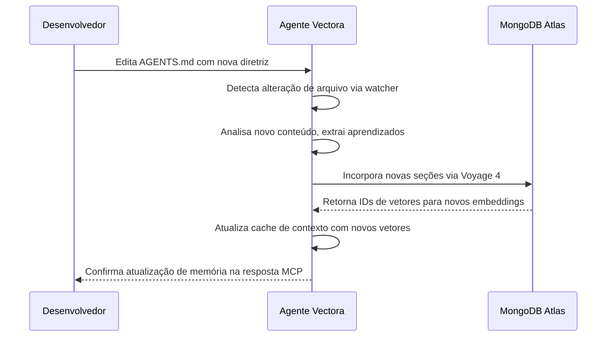



A camada de persistência de estado do Vectora garante que os agentes mantenham a continuidade entre as interações, permitindo tarefas de longo prazo, aprendizado incremental e consciência contextual que sobrevivem a reinicializações de IDE, desconexões de MCP e reinicializações do sistema.

Diferente dos sistemas RAG tradicionais que tratam cada consulta como independente, o Vectora trata o estado como uma prioridade absoluta: o que o agente aprendeu ontem informa o que ele faz hoje.

## Mantendo o Contexto Entre Sessões

O sistema de persistência rastreia a evolução do conhecimento do agente e o estado de execução atual de várias tarefas.

## Visão Geral da Arquitetura

O estado no Vectora é gerenciado por meio de três mecanismos complementares:

```mermaid
graph TD
    A[Sessão MCP] --> Vectora Cognitive Runtime[Vectora Cognitive Runtime: Tactical Brain]
    Vectora Cognitive Runtime --> B[Estado Operacional]
    Vectora Cognitive Runtime --> C[Camada de Memória]
    Vectora Cognitive Runtime --> D[Trilha de Auditoria]

    B --> E[MongoDB Atlas: coleção sessions]
    C --> F[AGENTS.md + Embeddings Vetoriais]
    D --> G[MongoDB Atlas: coleção audit_logs]

    E --> H[Memória de trabalho: plano atual, histórico de ferramentas, cache de contexto]
    F --> I[Memória de longo prazo: padrões aprendidos, preferências, conhecimento do projeto]
    G --> J[Compliance: quem fez o quê, quando e por quê]
```

O **[Vectora Cognitive Runtime (Decision Engine)](/models/vectora-decision-engine/)** orquestra como e quando o estado é persistido, garantindo que apenas informações taticamente relevantes sejam consolidadas na memória de longo prazo.

## Estado Operacional (coleção sessions)

Estado de curta duração que rastreia o contexto de execução atual:

| Campo           | Tipo      | Descrição                                                          |
| --------------- | --------- | ------------------------------------------------------------------ |
| `session_id`    | string    | Identificador único para a sessão MCP                              |
| `user_id`       | string    | Usuário autenticado via Kaffyn SSO                                 |
| `namespace`     | string    | Contexto isolado de projeto/workspace                              |
| `current_plan`  | objeto    | Plano de execução ativo com etapas e dependências                  |
| `tool_history`  | array     | Sequência de chamadas de ferramentas com entradas, saídas e tempo  |
| `context_cache` | objeto    | Embeddings pré-buscados, ASTs analisadas e dependências resolvidas |
| `created_at`    | timestamp | Hora de início da sessão                                           |
| `last_activity` | timestamp | Última interação MCP (usada para limpeza TTL)                      |

## Camada de Memória (AGENTS.md + embeddings)

Conhecimento de longo prazo que persiste além das sessões individuais:

- **AGENTS.md**: Arquivo de memória legível por humanos armazenado na raiz do projeto, contendo padrões aprendidos, preferências e diretrizes específicas do projeto.
- **Embeddings vetoriais**: Representação semântica do conteúdo do AGENTS.md indexada no MongoDB Atlas para recuperação durante a construção do contexto.
- **Atualizações incrementais**: Novos aprendizados são anexados ao AGENTS.md e re-incorporados sem re-indexar o arquivo inteiro.

## Trilha de Auditoria (coleção audit_logs)

Registros imutáveis de ações do agente para conformidade e depuração:

| Campo             | Tipo      | Descrição                                                             |
| ----------------- | --------- | --------------------------------------------------------------------- |
| `log_id`          | string    | Identificador único de registro de auditoria                          |
| `session_id`      | string    | Referência à sessão de origem                                         |
| `action`          | string    | Nome da ferramenta ou evento do sistema                               |
| `input_hash`      | string    | SHA-256 dos argumentos da ferramenta (nunca armazena segredos brutos) |
| `output_metadata` | objeto    | Metadados de resultado não sensíveis (status, duração, tokens)        |
| `security_flags`  | array     | Validações do Guardian, verificações de blocklist, sanitização        |
| `timestamp`       | timestamp | Hora precisa do evento com resolução de milissegundos                 |

## Gerenciamento do Ciclo de Vida da Sessão

Gerenciar o ciclo de vida de uma sessão garante que os recursos sejam alocados de forma eficiente e limpos quando não forem mais necessários.

## Criação de Sessão

Quando um cliente MCP se conecta, o sistema segue uma sequência específica para estabelecer um ambiente seguro e contextual:

1. O Vectora valida o JWT do Kaffyn SSO.
2. Verifica sessões ativas existentes para este `user_id` + `namespace`.
3. Cria um novo documento de sessão com a estrutura `current_plan` padrão.
4. Carrega o AGENTS.md, se presente, e atualiza o cache de contexto.
5. Retorna o `session_id` ao cliente para solicitações subsequentes.

## Continuidade da Sessão

Para interações contínuas, o sistema mantém o vínculo entre o cliente e o estado armazenado:

1. O cliente inclui o `session_id` nos cabeçalhos da solicitação MCP.
2. O Vectora carrega o estado operacional do MongoDB Atlas.
3. Atualiza o timestamp `last_activity` para evitar a limpeza TTL.
4. Executa a chamada da ferramenta com total consciência do contexto.
5. Persiste o estado atualizado antes de responder.

## Limpeza de Sessão

A manutenção automática via índices TTL do MongoDB garante que o banco de dados não cresça indefinidamente:

```yaml
sessions:
  ttl_field: "last_activity"
  ttl_seconds: 86400 # 24 horas de inatividade

audit_logs:
  ttl_field: "timestamp"
  ttl_seconds: 7776000 # 90 dias de retenção (configurável por plano)
```

A limpeza manual via CLI fornece controle mais granular sobre o gerenciamento de estado:

```bash
# Deletar sessões expiradas para um namespace
vectora state cleanup --namespace meu-projeto --dry-run

# Forçar a exclusão de uma sessão específica
vectora state delete --session-id sess_abc123

# Exportar o estado da sessão antes da exclusão
vectora state export --session-id sess_abc123 --output ./backup.json
```

## AGENTS.md: Interface de Memória Homem-Máquina

O AGENTS.md serve como a ponte entre o entendimento humano e a memória do agente:

## Estrutura e Organização

A estrutura do arquivo AGENTS.md foi projetada para ser facilmente legível tanto por desenvolvedores quanto por agentes de IA:

```markdown
# Memória do Projeto: meu-projeto

## Padrões Aprendidos

- Fluxos de autenticação usam JWT com expiração de 1 hora
- Conexões de banco de dados usam pool de conexões com no máximo 10 conexões
- O tratamento de erros segue o padrão Result<T, E>

## Preferências

- Preferir composição funcional em vez de herança de classes
- Usar o modo estrito do TypeScript para todos os novos arquivos
- Níveis de log: debug para desenvolvimento, info para produção

## Diretrizes do Projeto

- Todos os endpoints de API devem incluir anotações OpenAPI
- Os testes devem atingir 80% de cobertura de ramificações
- Revisões de segurança são necessárias para quaisquer alterações relacionadas à autenticação
```

## Fluxo de Trabalho de Integração

O diagrama a seguir ilustra como as alterações no AGENTS.md são propagadas pelo sistema:



## Considerações de Segurança

A segurança é uma preocupação primária para a camada de persistência de estado, com várias salvaguardas em vigor:

- O AGENTS.md está sujeito à mesma lista de bloqueio do Guardian que outros arquivos: padrões `.env`, `.key`, `.pem` nunca são incorporados.
- Conteúdo sensível detectado via regex é redigido antes da incorporação.
- O isolamento de namespace garante que o AGENTS.md de um projeto nunca influencie outro.

## Integração com Agentic Framework: Validando o Gerenciamento de Estado

O Agentic Framework inclui testes específicos para persistência de estado para garantir a confiabilidade:

```yaml
# tests/state/session-continuity.yaml
id: "state-session-continuity"
name: "Agente mantém o plano apesar de desconexões MCP"

task:
  prompt: "Continue refatorando o módulo auth de onde paramos"
  session_id: "${PREVIOUS_SESSION_ID}"

context:
  providers: [vectora]
  namespace: auth-service
  load_agents_md: true

expectations:
  state:
    plan_resumed: true
    tool_history_preserved: true
    context_cache_reused: true
  output:
    references_previous_steps: true
    avoids_redundant_work: true

evaluation:
  judge_config: { method: "hybrid", judge_model: "gemini-3-flash" }
  scoring:
    weights: { correctness: 0.40, performance: 0.30, maintainability: 0.30 }
  thresholds: { pass_score: 0.75 }
```

## Referência de Configuração

A configuração da camada de estado permite o ajuste fino do equilíbrio entre persistência e desempenho.

## vectora.config.yaml

As seguintes configurações controlam como a camada de estado se comporta globalmente:

```yaml
state:
  # Gerenciamento de sessão
  session:
    ttl_hours: 24 # Tempo limite de inatividade antes da limpeza
    max_concurrent: 5 # Limite de sessões por usuário/namespace
    persist_on_exit: true # Salvar estado quando a conexão MCP fechar

  # Camada de memória
  memory:
    agents_file: "AGENTS.md" # Caminho relativo à raiz do projeto
    auto_update: true # Incorporar automaticamente novo conteúdo do AGENTS.md
    embedding_model: "voyage-4" # Modelo para embeddings de memória
    max_memory_tokens: 4096 # Limitar contexto injetado da memória

  # Configurações de auditoria
  audit:
    enabled: true
    retain_days: 90 # Período de retenção para logs de auditoria
    redact_patterns: # Padrões regex adicionais para redigir
      - "password\\s*[:=]\\s*['\"]?[^'\"\\s]+"
      - "api[_-]?key\\s*[:=]\\s*['\"]?[^'\"\\s]+"

  # Conexão backend (gerenciada por Kaffyn)
  mongodb:
    database: "vectora"
    collections:
      sessions: "sessions"
      audit: "audit_logs"
      memory_vectors: "memory_embeddings"
```

## Otimizações de Desempenho

Otimizar as operações de estado é crucial para manter uma experiência de agente responsiva.

## Estratégia de Cache de Contexto

Para minimizar a latência durante a continuidade da sessão, o Vectora emprega várias técnicas de cache:

- **Evicção LRU**: Manter os embeddings acessados mais recentemente na memória.
- **Prefetching**: Carregar o contexto provavelmente necessário com base na etapa atual do plano.
- **Atualizações delta**: Apenas re-incorporar seções alteradas do AGENTS.md, não o arquivo inteiro.

## Operações em Lote

As operações do MongoDB são agrupadas em lotes para eficiência e para maximizar o rendimento:

```typescript
// packages/core/src/state/batch-operations.ts
export async function updateSessionState(sessionId: string, updates: StateUpdate[]): Promise<void> {
  // Agrupar atualizações por coleção para operações em massa
  const byCollection = groupByCollection(updates);

  // Executar gravações em massa com ordered=false para paralelismo
  await Promise.all(
    Object.entries(byCollection).map(([collection, ops]) =>
      mongodb.collection(collection).bulkWrite(ops, { ordered: false }),
    ),
  );
}
```

## Solução de Problemas

Resolver problemas com a persistência de estado geralmente envolve verificar a conectividade e as cotas.

## Sessão Não Encontrada

Se uma sessão for relatada como não encontrada, considere as seguintes possibilidades:

```text
Erro: Sessão sess_abc123 não encontrada para o namespace auth-service
```

Causas possíveis:

- Sessão expirou devido à limpeza TTL (verifique o timestamp `last_activity`).
- Incompatibilidade de namespace entre a solicitação do cliente e a sessão armazenada.
- Problema de conectividade com o MongoDB Atlas.

Resolução:

```bash
# Verificar se a sessão existe
vectora state list --namespace auth-service

# Verificar conectividade com o MongoDB
vectora health check --component mongodb

# Reconectar com uma nova sessão
vectora auth refresh
```

## AGENTS.md Não Atualizando a Memória

Quando as alterações no AGENTS.md são detectadas, mas não refletidas na memória do agente:

```text
Aviso: Alterações no AGENTS.md detectadas, mas a memória não foi atualizada
```

Causas possíveis:

- Cota de incorporação esgotada (verifique os limites do plano).
- A lista de bloqueio do Guardian impediu a incorporação de novo conteúdo.
- API Voyage temporariamente indisponível.

Resolução:

```bash
# Verificar status da cota de incorporação
vectora quota status --component embeddings

# Acionar manualmente a atualização de memória
vectora memory sync --file AGENTS.md

# Revisar logs do Guardian para conteúdo bloqueado
vectora logs --filter guardian --namespace auth-service
```

## Logs de Auditoria com Entradas Ausentes

Se os registros de auditoria esperados estiverem ausentes dos logs:

```text
Aviso: Entrada de auditoria esperada para tool_call não encontrada
```

Causas possíveis:

- Registro de auditoria desabilitado na configuração.
- Preocupação de gravação do MongoDB não atendida (problema de rede).
- A limpeza da sessão excluiu os registros de auditoria relacionados prematuramente.

Resolução:

```bash
# Verificar configuração de auditoria
vectora config get state.audit.enabled

# Verificar operações de gravação do MongoDB
vectora health check --component mongodb --verbose

# Revisar configurações TTL para a coleção audit_logs
vectora config get state.audit.retain_days
```

## Perguntas Frequentes (FAQ)

Perguntas comuns sobre persistência de estado e gerenciamento de memória:

**P: Posso desativar a persistência de estado para projetos sensíveis à privacidade?**
R: Sim. Defina `state.session.persist_on_exit: false` e `state.audit.enabled: false` no vectora.config.yaml. Observe que isso desativa a continuidade da sessão e o log de conformidade.

**P: Como o AGENTS.md é diferente da documentação regular do projeto?**
R: O AGENTS.md é analisado e incorporado especificamente para a memória do agente. Arquivos de documentação regular são indexados via pipeline RAG padrão. O conteúdo do AGENTS.md recebe maior prioridade durante a construção do contexto.

**P: O que acontece com o estado quando eu mudo do Pro para o Free?**
R: As sessões e os logs de auditoria são retidos por 90 dias conforme a política de retenção. Se o seu uso exceder os limites do nível Free, novas gravações de estado serão bloqueadas até que você faça o upgrade ou libere espaço. Os dados existentes permanecem acessíveis para exportação.

**P: Múltiplos agentes podem compartilhar o mesmo AGENTS.md?**
R: Sim, dentro do mesmo namespace. O AGENTS.md tem escopo de projeto, não de usuário. Todos os agentes que operam no namespace "auth-service" verão o mesmo arquivo de memória. Use namespaces separados para isolamento.

**P: Como faço para migrar o estado entre regiões do MongoDB Atlas?**
R: Use o fluxo de trabalho de exportação/importação:

```bash
# Exportar da região de origem
vectora state export --namespace meu-projeto --output ./state-backup.json

# Importar para a região de destino
vectora state import --namespace meu-projeto --input ./state-backup.json --region us-east-1
```

Frase para lembrar:
"A persistência de estado transforma consultas isoladas em colaboração contínua. O estado operacional rastreia o agora, a memória preserva o aprendido e a auditoria garante a responsabilidade."

## External Linking

| Concept               | Resource                             | Link                                                                                                       |
| --------------------- | ------------------------------------ | ---------------------------------------------------------------------------------------------------------- |
| **MongoDB Atlas**     | Atlas Vector Search Documentation    | [www.mongodb.com/docs/atlas/atlas-vector-search/](https://www.mongodb.com/docs/atlas/atlas-vector-search/) |
| **MCP**               | Model Context Protocol Specification | [modelcontextprotocol.io/specification](https://modelcontextprotocol.io/specification)                     |
| **MCP Go SDK**        | Go SDK for MCP (mark3labs)           | [github.com/mark3labs/mcp-go](https://github.com/mark3labs/mcp-go)                                         |
| **Voyage AI**         | High-performance embeddings for RAG  | [www.voyageai.com/](https://www.voyageai.com/)                                                             |
| **Voyage Embeddings** | Voyage Embeddings Documentation      | [docs.voyageai.com/docs/embeddings](https://docs.voyageai.com/docs/embeddings)                             |
| **Voyage Reranker**   | Voyage Reranker API                  | [docs.voyageai.com/docs/reranker](https://docs.voyageai.com/docs/reranker)                                 |

---

_Parte do ecossistema Vectora_ · [Open Source (MIT)](https://github.com/Kaffyn/Vectora) · [Contribuidores](https://github.com/Kaffyn/Vectora/graphs/contributors)
