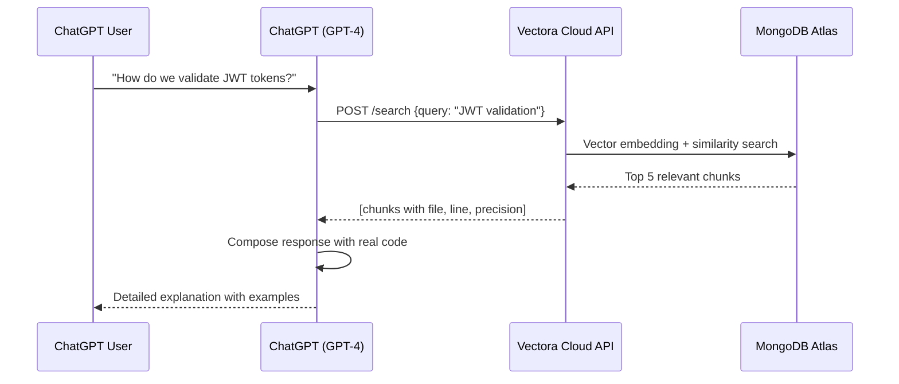



Vectora functions as a **Custom GPT Plugin** that extends ChatGPT with semantic codebase context search. The plugin connects directly to **Vectora Cloud**, which executes the Vectora Core managed internally on scalable infrastructure, eliminating the need for local server configuration.

By utilizing this integration, developers can leverage the conversational power of ChatGPT while maintaining access to their specific project knowledge.

> [!IMPORTANT] > **ChatGPT Custom GPT Plugin (via Vectora Cloud) vs MCP Protocol (local IDE)**. Choose based on your preference and workflow:
>
> - **Cloud**: ChatGPT in browser, shareable, managed Vectora, easy access.
> - **MCP**: Claude Code/Cursor, local-first, zero cloud data, maximum privacy.

## Architecture: ChatGPT ↔ Vectora Cloud ↔ MongoDB Atlas

The following diagram illustrates the data flow between the user's browser, OpenAI's servers, and the Vectora Cloud infrastructure.

```mermaid
graph LR
    A[ChatGPT Web] -->|Custom GPT Prompt| B[ChatGPT (GPT-4)]
    B -->|JSON OpenAPI Call| C["Vectora Cloud API<br/>(managed)"]
    C -->|Semantic Search| D["MongoDB Atlas<br/>Vector Search"]
    D -->|Code Chunks| C
    C -->|Tool Results| B
    B -->|Contextual Response| A
```

## How It Works: Complete Flow

When a user asks a question, ChatGPT recognizes the intent and triggers a search through the Vectora plugin.



### Event Sequence (Step-by-Step)

1. **Initial Setup**: Create an API Key in the Vectora Console, set up a Custom GPT, and add the OpenAPI schema.
2. **User Conversation**: The user asks a technical question; ChatGPT recognizes the need for context and calls the `/search` endpoint.
3. **Contextual Response**: ChatGPT receives the code chunks, including file names and line numbers, and explains the implementation based on real project data.

## Installation & Complete Configuration

To get started with the ChatGPT integration, ensure you have the necessary accounts and follow the steps below.

### Prerequisites

- **ChatGPT Plus** (required for access to Custom GPTs).
- **[Vectora Cloud](https://console.vectora.app)** account (Free/Pro/Team/Enterprise).
- **Indexed Project** with code already synchronized and processed.
- **Vectora Cloud API Key** with `search` scope.

### Compatibility Check

```bash
curl -X GET https://api.vectora.app/v1/health \
  -H "Authorization: Bearer vca_live_xxxxx"

# Expected: 200 OK with "healthy" status
```

## Step 1: Obtain Vectora Cloud Credentials

Access the management console to generate the security token needed for the integration.

### 1.1 Access the Console

1. Navigate to [console.vectora.app](https://console.vectora.app).
2. Log in with your Vectora account.
3. Select the desired project (or create a new one).

### 1.2 Generate API Key

1. Go to **Settings → API Keys**.
2. Click on **"New API Key"**.
3. Configure the fields:
   - **Name**: `"ChatGPT Plugin"`
   - **Scope**: `search` (read-only permission)
   - **TTL**: `365 days`
4. Click **"Generate"** and **copy the key immediately**: `vca_live_xxxxxxxxxxxxxxxxxxxxxxxx`.

### 1.3 Verify Access

```bash
# Test if the API Key works
curl -X POST https://api.vectora.app/v1/search \
  -H "Authorization: Bearer vca_live_xxxxx" \
  -H "Content-Type: application/json" \
  -d '{
    "query": "test query",
    "namespace": "your-namespace",
    "top_k": 1
  }'

# Expected: 200 OK with result array
```

## Step 2: Create Custom GPT in ChatGPT

Once you have your credentials, you can configure the AI assistant in the OpenAI interface.

1. Go to [chatgpt.com/gpts/editor](https://chatgpt.com/gpts/editor).
2. Click **"Create a new GPT"** to enter the GPT Builder.
3. In the **"Configure"** tab, set the name to `Vectora Codebase Assistant` and provide a descriptive summary.

## Step 3: Configure OpenAPI Schema

In the **"Configure"** tab, scroll down to **"Actions"** and click **"Create new action"**.

### 3.1 Provide OpenAPI Schema

Paste the following YAML schema into the editor to define the communication protocol between ChatGPT and Vectora.

```yaml
openapi: 3.0.0
info:
  title: Vectora Cloud API
  version: 1.0.0
  description: "Semantic codebase search integration with MongoDB Atlas Vector Search"
servers:
  - url: https://api.vectora.app/v1/plugins
    description: "Managed Vectora Cloud endpoint"

paths:
  /search:
    post:
      summary: "Semantic search for code, documentation, and patterns"
      operationId: search_context
      requestBody:
        required: true
        content:
          application/json:
            schema:
              type: object
              required: [query, namespace]
              properties:
                query:
                  type: string
                  description: "Natural language query (e.g., 'How to validate JWT?')"
                namespace:
                  type: string
                  description: "Project namespace"
                top_k:
                  type: integer
                  description: "Max results (default: 5, max: 20)"
                  default: 5
      responses:
        "200":
          description: "Search results successfully retrieved"
          content:
            application/json:
              schema:
                type: object
                properties:
                  chunks:
                    type: array
                    items:
                      type: object
                      properties:
                        file: { type: string }
                        line: { type: integer }
                        code: { type: string }

  /analyze-dependencies:
    post:
      summary: "Analyze symbol references and dependencies"
      operationId: analyze_dependencies
      requestBody:
        required: true
        content:
          application/json:
            schema:
              type: object
              required: [symbol, namespace]
              properties:
                symbol: { type: string }
                namespace: { type: string }
      responses:
        "200":
          description: "Dependency analysis complete"

components:
  securitySchemes:
    apiKeyAuth:
      type: apiKey
      in: header
      name: Authorization
      description: "Bearer token (vca_live_xxxxx)"

security:
  - apiKeyAuth: []
```

### 3.2 Configure Authentication

1. In the **"Authentication"** section of the Action:
   - Select: **"API Key"**.
   - **Header name**: `Authorization`.
   - **Value**: `Bearer vca_live_xxxxx` (your actual key).
2. Click **"Save"**.

## Step 4: Add System Instructions

In the **"Instructions"** tab of the GPT Builder, define the AI's behavior rules to ensure it uses the Vectora plugin effectively.

```text
You are an EXPERT code analysis assistant using Vectora Cloud.

## CORE RULE
Always use Vectora to fetch REAL codebase context. Never guess or rely on general knowledge. Accurate citation is more important than speed.

## PROCEDURE FOR CODE QUERIES
1. INTERPRET: Understand what the user wants.
2. SEARCH: Use "search_context" with a precise query.
3. ANALYZE: If code is retrieved, show the exact file and line number. Cite relevant snippets (<10 lines).
4. COMPLEMENT: Use "analyze-dependencies" if you need to understand callers or references.
5. RESPOND: Always cite the file path, line number, and a brief explanation of why this code is relevant.

## PRIVACY RULES
- Never expose secrets or credentials found in the code.
- Redact passwords, keys, and tokens.
- Notify the user if sensitive data was found but redacted.
```

## Workflows & Use Cases

The following examples demonstrate how to interact with the Vectora-powered ChatGPT assistant.

### Workflow: Onboarding & Understanding

**Scenario**: A new developer wants to understand the JWT authentication flow.

- **User**: "How does the JWT authentication system work here?"
- **Assistant**: Performs a search and identifies `src/auth/jwt.ts` for definition, `src/guards/auth.guard.ts` for application, and `src/tests/auth.test.ts` for examples. It then explains the end-to-end request flow.

### Workflow: Strategic Debugging

**Scenario**: Investigating a specific error message.

- **User**: "Test 'should create user' is failing with 'Cannot read property id of undefined'. Where is the problem?"
- **Assistant**: Searches for the test and the `userService.create` implementation. It identifies that the function inserts data into the DB but fails to return the created object, causing the undefined error in the test.

## Troubleshooting & Maintenance

If you encounter issues with the integration, verify the following common scenarios.

### "Plugin not responding"

Ensure that your project indexing is complete in the [Vectora Console](https://console.vectora.app). Check the status under **Settings → Indexing**. Large repositories may take some time to process.

### "Unauthorized" (401)

This typically means the API Key is invalid, expired, or missing the `search` scope. Generate a new key in the console and update the **Authentication** settings in the Custom GPT Builder.

### Performance & Timeouts

If searches are taking too long (>30s), try reducing the `top_k` parameter in your instructions. Using a value of 5 is generally optimal for performance while still providing sufficient context.

## External Linking

| Concept           | Resource                             | Link                                                                                                       |
| ----------------- | ------------------------------------ | ---------------------------------------------------------------------------------------------------------- |
| **MongoDB Atlas** | Atlas Vector Search Documentation    | [www.mongodb.com/docs/atlas/atlas-vector-search/](https://www.mongodb.com/docs/atlas/atlas-vector-search/) |
| **MCP**           | Model Context Protocol Specification | [modelcontextprotocol.io/specification](https://modelcontextprotocol.io/specification)                     |
| **MCP Go SDK**    | Go SDK for MCP (mark3labs)           | [github.com/mark3labs/mcp-go](https://github.com/mark3labs/mcp-go)                                         |
| **OpenAI**        | OpenAI API Documentation             | [platform.openai.com/docs/](https://platform.openai.com/docs/)                                             |
| **JWT**           | RFC 7519: JSON Web Token Standard    | [datatracker.ietf.org/doc/html/rfc7519](https://datatracker.ietf.org/doc/html/rfc7519)                     |
| **OpenAPI**       | OpenAPI Specification                | [swagger.io/specification/](https://swagger.io/specification/)                                             |

---

_Part of the Vectora ecosystem_ · [Open Source (MIT)](https://github.com/Kaffyn/Vectora) · [Contributors](https://github.com/Kaffyn/Vectora/graphs/contributors)
