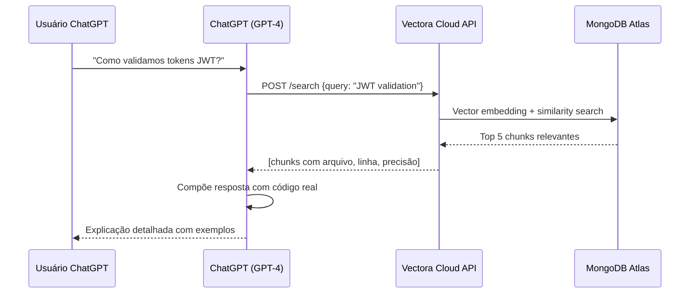



O Vectora funciona como um **Custom GPT Plugin** que estende o ChatGPT com busca semântica de contexto de codebase. O plugin se conecta diretamente ao **Vectora Cloud**, que executa o Vectora Core gerenciado internamente em uma infraestrutura escalável, eliminando a necessidade de configuração de servidores locais.

Ao utilizar esta integração, os desenvolvedores podem aproveitar o poder conversacional do ChatGPT mantendo o acesso ao conhecimento específico do seu projeto.

> [!IMPORTANT] > **ChatGPT Custom GPT Plugin (via Vectora Cloud) vs Protocolo MCP (IDE local)**. Escolha conforme sua preferência e workflow:
>
> - **Cloud**: ChatGPT no navegador, compartilhável, Vectora gerenciado, fácil acesso.
> - **MCP**: Claude Code/Cursor, local-first, zero dados na nuvem, máxima privacidade.

## Arquitetura: ChatGPT ↔ Vectora Cloud ↔ MongoDB Atlas

O diagrama a seguir ilustra o fluxo de dados entre o navegador do usuário, os servidores da OpenAI e a infraestrutura do Vectora Cloud.

```mermaid
graph LR
    A[ChatGPT Web] -->|Custom GPT Prompt| B[ChatGPT (GPT-4)]
    B -->|JSON OpenAPI Call| C["Vectora Cloud API<br/>(gerenciado)"]
    C -->|Busca Semântica| D["MongoDB Atlas<br/>Vector Search"]
    D -->|Chunks de Código| C
    C -->|Tool Results| B
    B -->|Resposta Contextualizada| A
```

## Como Funciona: Fluxo Completo

Quando um usuário faz uma pergunta, o ChatGPT reconhece a intenção e aciona uma busca através do plugin do Vectora.



### Sequência de Eventos (Passo a Passo)

1. **Configuração Inicial**: Criação de uma API Key no Console do Vectora, configuração de um Custom GPT e adição do schema OpenAPI.
2. **Conversa do Usuário**: O usuário faz uma pergunta técnica; o ChatGPT reconhece a necessidade de contexto e chama o endpoint `/search`.
3. **Resposta Contextualizada**: O ChatGPT recebe os chunks de código, incluindo nomes de arquivos e números de linha, e explica a implementação baseada em dados reais do projeto.

## Instalação & Configuração Completa

Para começar com a integração do ChatGPT, garanta que você tenha as contas necessárias e siga os passos abaixo.

### Pré-requisitos

- **ChatGPT Plus** (necessário para acesso a Custom GPTs).
- **[Vectora Cloud](https://console.vectora.app)** conta (Free/Pro/Team/Enterprise).
- **Projeto Indexado** com código já sincronizado e processado.
- **Vectora Cloud API Key** com escopo `search`.

### Verificação de Compatibilidade

```bash
curl -X GET https://api.vectora.app/v1/health \
  -H "Authorization: Bearer vca_live_xxxxx"

# Esperado: 200 OK com status "healthy"
```

## Passo 1: Obter Credenciais do Vectora Cloud

Acesse o console de gerenciamento para gerar o token de segurança necessário para a integração.

### 1.1 Acesso ao Console

1. Navegue para [console.vectora.app](https://console.vectora.app).
2. Faça login com sua conta Vectora.
3. Selecione o projeto desejado (ou crie um novo).

### 1.2 Gerar API Key

1. Vá para **Settings → API Keys**.
2. Clique em **"New API Key"**.
3. Configure os campos:
   - **Name**: `"ChatGPT Plugin"`
   - **Scope**: `search` (permissão apenas de leitura)
   - **TTL**: `365 days`
4. Clique em **"Generate"** e **copie a chave imediatamente**: `vca_live_xxxxxxxxxxxxxxxxxxxxxxxx`.

### 1.3 Verificar Acesso

```bash
# Testar se a API Key funciona
curl -X POST https://api.vectora.app/v1/search \
  -H "Authorization: Bearer vca_live_xxxxx" \
  -H "Content-Type: application/json" \
  -d '{
    "query": "test query",
    "namespace": "seu-namespace",
    "top_k": 1
  }'

# Esperado: 200 OK com array de resultados
```

## Passo 2: Criar Custom GPT no ChatGPT

Uma vez que você tenha suas credenciais, você pode configurar o assistente de IA na interface da OpenAI.

1. Vá para [chatgpt.com/gpts/editor](https://chatgpt.com/gpts/editor).
2. Clique em **"Create a new GPT"** para entrar no GPT Builder.
3. Na aba **"Configure"**, defina o nome como `Vectora Codebase Assistant` e forneça um resumo descritivo.

## Passo 3: Configurar Schema OpenAPI

Na aba **"Configure"**, role para baixo até **"Actions"** e clique em **"Create new action"**.

### 3.1 Fornecer Schema OpenAPI

Cole o seguinte schema YAML no editor para definir o protocolo de comunicação entre o ChatGPT e o Vectora.

```yaml
openapi: 3.0.0
info:
  title: Vectora Cloud API
  version: 1.0.0
  description: "Integração de busca semântica de codebase com MongoDB Atlas Vector Search"
servers:
  - url: https://api.vectora.app/v1/plugins
    description: "Endpoint gerenciado do Vectora Cloud"

paths:
  /search:
    post:
      summary: "Busca semântica por código, documentação e padrões"
      operationId: search_context
      requestBody:
        required: true
        content:
          application/json:
            schema:
              type: object
              required: [query, namespace]
              properties:
                query:
                  type: string
                  description: "Consulta em linguagem natural (ex: 'Como validar JWT?')"
                namespace:
                  type: string
                  description: "Namespace do projeto"
                top_k:
                  type: integer
                  description: "Máximo de resultados (padrão: 5, máx: 20)"
                  default: 5
      responses:
        "200":
          description: "Resultados de busca recuperados com sucesso"
          content:
            application/json:
              schema:
                type: object
                properties:
                  chunks:
                    type: array
                    items:
                      type: object
                      properties:
                        file: { type: string }
                        line: { type: integer }
                        code: { type: string }

  /analyze-dependencies:
    post:
      summary: "Analisar referências de símbolos e dependências"
      operationId: analyze_dependencies
      requestBody:
        required: true
        content:
          application/json:
            schema:
              type: object
              required: [symbol, namespace]
              properties:
                symbol: { type: string }
                namespace: { type: string }
      responses:
        "200":
          description: "Análise de dependências concluída"

components:
  securitySchemes:
    apiKeyAuth:
      type: apiKey
      in: header
      name: Authorization
      description: "Bearer token (vca_live_xxxxx)"

security:
  - apiKeyAuth: []
```

### 3.2 Configurar Autenticação

1. Na seção **"Authentication"** da Action:
   - Selecione: **"API Key"**.
   - **Header name**: `Authorization`.
   - **Value**: `Bearer vca_live_xxxxx` (sua chave real).
2. Clique em **"Save"**.

## Passo 4: Adicionar Instruções de Sistema

Na aba **"Instructions"** do GPT Builder, defina as regras de comportamento da IA para garantir que ela use o plugin do Vectora de forma eficaz.

```text
Você é um assistente EXPERT em análise de código usando Vectora Cloud.

## REGRA FUNDAMENTAL
Sempre use o Vectora para buscar o contexto REAL da base de código. Nunca adivinhe ou dependa de conhecimento genérico. A citação precisa é mais importante que a velocidade.

## PROCEDIMENTO PARA CONSULTAS DE CÓDIGO
1. INTERPRETAR: Entenda o que o usuário deseja.
2. BUSCAR: Use "search_context" com uma consulta precisa.
3. ANALISAR: Se o código for recuperado, mostre o arquivo exato e o número da linha. Cite trechos relevantes (<10 linhas).
4. COMPLEMENTAR: Use "analyze-dependencies" se precisar entender chamadores ou referências.
5. RESPONDER: Sempre cite o caminho do arquivo, o número da linha e uma breve explicação de por que este código é relevante.

## REGRAS DE PRIVACIDADE
- Nunca exponha segredos ou credenciais encontrados no código.
- Redija senhas, chaves e tokens.
- Notifique o usuário se dados sensíveis foram encontrados, mas redigidos.
```

## Workflows & Casos de Uso

Os exemplos a seguir demonstram como interagir com o assistente do ChatGPT alimentado pelo Vectora.

### Workflow: Onboarding & Entendimento

**Cenário**: Um novo desenvolvedor quer entender o fluxo de autenticação JWT.

- **Usuário**: "Como funciona o sistema de autenticação JWT aqui?"
- **Assistente**: Realiza uma busca e identifica `src/auth/jwt.ts` para definição, `src/guards/auth.guard.ts` para aplicação e `src/tests/auth.test.ts` para exemplos. Em seguida, explica o fluxo de requisição de ponta a ponta.

### Workflow: Debugging Estratégico

**Cenário**: Investigando uma mensagem de erro específica.

- **Usuário**: "O teste 'should create user' está falhando com 'Cannot read property id of undefined'. Onde está o problema?"
- **Assistente**: Busca pelo teste e pela implementação de `userService.create`. Ele identifica que a função insere dados no DB, mas falha ao retornar o objeto criado, causando o erro de undefined no teste.

## Solução de Problemas & Manutenção

Se você encontrar problemas com a integração, verifique os seguintes cenários comuns.

### "Plugin não respondendo"

Certifique-se de que a indexação do seu projeto esteja completa no [Console do Vectora](https://console.vectora.app). Verifique o status em **Settings → Indexing**. Repositórios grandes podem levar algum tempo para serem processados.

### "Não autorizado" (401)

Isso geralmente significa que a API Key é inválida, expirou ou não possui o escopo `search`. Gere uma nova chave no console e atualize as configurações de **Authentication** no Custom GPT Builder.

### Performance & Timeouts

Se as buscas estiverem demorando muito (>30s), tente reduzir o parâmetro `top_k` em suas instruções. Usar um valor de 5 é geralmente o ideal para performance, ao mesmo tempo em que fornece contexto suficiente.

## External Linking

| Concept           | Resource                             | Link                                                                                                       |
| ----------------- | ------------------------------------ | ---------------------------------------------------------------------------------------------------------- |
| **MongoDB Atlas** | Atlas Vector Search Documentation    | [www.mongodb.com/docs/atlas/atlas-vector-search/](https://www.mongodb.com/docs/atlas/atlas-vector-search/) |
| **MCP**           | Model Context Protocol Specification | [modelcontextprotocol.io/specification](https://modelcontextprotocol.io/specification)                     |
| **MCP Go SDK**    | Go SDK for MCP (mark3labs)           | [github.com/mark3labs/mcp-go](https://github.com/mark3labs/mcp-go)                                         |
| **OpenAI**        | OpenAI API Documentation             | [platform.openai.com/docs/](https://platform.openai.com/docs/)                                             |
| **JWT**           | RFC 7519: JSON Web Token Standard    | [datatracker.ietf.org/doc/html/rfc7519](https://datatracker.ietf.org/doc/html/rfc7519)                     |
| **OpenAPI**       | OpenAPI Specification                | [swagger.io/specification/](https://swagger.io/specification/)                                             |

---

_Parte do ecossistema Vectora_ · [Open Source (MIT)](https://github.com/Kaffyn/Vectora) · [Contribuidores](https://github.com/Kaffyn/Vectora/graphs/contributors)
