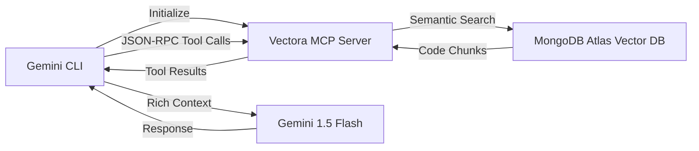



The **Google Gemini CLI** allows you to integrate Vectora as an **MCP Server** (Model Context Protocol). This enables Gemini to access codebase context managed by Vectora during interactive terminal conversations.

By using the MCP protocol, Vectora acts as a specialized data provider that feeds relevant code snippets directly into the Gemini reasoning engine.

> [!IMPORTANT] > **MCP Protocol**: Vectora functions as an MCP server that communicates with Gemini CLI via stdio. The communication is based on **JSON-RPC 2.0**, supporting tools, resources, and custom prompts.

## Architecture: Gemini CLI ↔ Vectora MCP Server

The integration follows a standard client-server pattern where the CLI manages the user interface and the Vectora server handles semantic retrieval.



## Complete Setup Guide

Follow these steps to configure your environment and connect Gemini CLI to your Vectora project.

### Step 1: Install Prerequisites

Ensure you have the Google Cloud SDK and the Gemini CLI installed on your machine.

1. **Install gcloud CLI**: Download from the official Google Cloud documentation or use a package manager like `brew` or `choco`.
2. **Authenticate**: Run `gcloud auth application-default login` to link your local environment with your Google Cloud account.
3. **Install Gemini CLI**: Execute `npm install -g @google/generative-ai-cli` and verify with `gemini --version`.

### Step 2: Configure Vectora as an MCP Server

Define the connection parameters in your local Gemini configuration file.

1. **Create/Edit `~/.gemini/config.json`**: Add the `mcpServers` block as shown below.

```json
{
  "apiKey": "your-gemini-api-key",
  "mcpServers": {
    "vectora": {
      "command": "vectora",
      "args": ["mcp", "--stdio"],
      "env": {
        "VECTORA_NAMESPACE": "your-project",
        "VECTORA_API_KEY": "vca_live_...",
        "VECTORA_LOG_LEVEL": "info"
      }
    }
  }
}
```

2. **API Key**: Obtain your Gemini key from [Google AI Studio](https://aistudio.google.com/app/apikeys).

### Step 3: Start an Interactive Session

Launch the CLI with a model that supports MCP tool calling.

```bash
gemini chat --model "gemini-1.5-flash"
```

The Gemini CLI will automatically detect and initialize the Vectora MCP server based on your configuration.

## Available MCP Tools

Once the connection is established, Gemini can invoke the following tools to gather context.

### 1. `search_context`

Performs semantic search across the project's code and documentation. It returns relevant code chunks along with metadata such as precision scores and file paths.

### 2. `analyze_code`

Provides targeted analysis of a specific file, focusing on patterns like security vulnerabilities, performance bottlenecks, or adherence to architectural standards.

### 3. `get_file_context`

Retrieves the full content of a file, optionally including its immediate dependencies to provide a broader view of the component's role in the system.

## Practical Workflows

These scenarios demonstrate how the integration can be used during daily development tasks.

- **Assisted Code Review**: Ask Gemini to "Review src/auth/validate.ts and suggest improvements." The CLI will fetch the file via Vectora and provide contextual advice.
- **Documentation Generation**: Command Gemini to "Generate documentation for the getUserById function." Vectora provides the source, and Gemini creates accurate docstrings.
- **Pattern Analysis**: Ask "What error handling patterns do we use in our APIs?" to get a summarized view of consistency across the codebase.

## Troubleshooting

If the integration fails, check the following common issues.

- **Server Not Starting**: Ensure the `vectora` CLI is installed globally and accessible in your system PATH.
- **Handshake Failed**: Test the MCP server manually by running `vectora mcp --stdio` and providing a test JSON-RPC initialization message.
- **Namespace Not Found**: Verify that the namespace defined in your config matches an existing project in Vectora using `vectora namespace list`.

## External Linking

| Concept           | Resource                             | Link                                                                                                       |
| ----------------- | ------------------------------------ | ---------------------------------------------------------------------------------------------------------- |
| **Gemini AI**     | Google DeepMind Gemini Models        | [deepmind.google/technologies/gemini/](https://deepmind.google/technologies/gemini/)                       |
| **Gemini API**    | Google AI Studio Documentation       | [ai.google.dev/docs](https://ai.google.dev/docs)                                                           |
| **MCP**           | Model Context Protocol Specification | [modelcontextprotocol.io/specification](https://modelcontextprotocol.io/specification)                     |
| **MCP Go SDK**    | Go SDK for MCP (mark3labs)           | [github.com/mark3labs/mcp-go](https://github.com/mark3labs/mcp-go)                                         |
| **MongoDB Atlas** | Atlas Vector Search Documentation    | [www.mongodb.com/docs/atlas/atlas-vector-search/](https://www.mongodb.com/docs/atlas/atlas-vector-search/) |
| **JSON-RPC**      | JSON-RPC 2.0 Specification           | [www.jsonrpc.org/specification](https://www.jsonrpc.org/specification)                                     |

---

_Part of the Vectora ecosystem_ · [Open Source (MIT)](https://github.com/Kaffyn/Vectora) · [Contributors](https://github.com/Kaffyn/Vectora/graphs/contributors)
