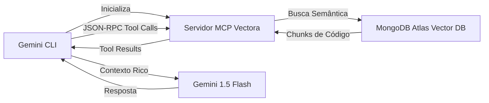



A **Google Gemini CLI** permite que você integre o Vectora como um **Servidor MCP** (Model Context Protocol). Isso permite que o Gemini acesse o contexto de código gerenciado pelo Vectora durante conversas interativas no terminal.

Ao usar o protocolo MCP, o Vectora atua como um provedor de dados especializado que fornece trechos de código relevantes diretamente para o motor de raciocínio do Gemini.

> [!IMPORTANT] > **Protocolo MCP**: O Vectora funciona como um servidor MCP que se comunica com a Gemini CLI via stdio. A comunicação é baseada em **JSON-RPC 2.0**, suportando ferramentas (tools), recursos (resources) e prompts personalizados.

## Arquitetura: Gemini CLI ↔ Servidor MCP Vectora

A integração segue um padrão cliente-servidor padrão, onde o CLI gerencia a interface do usuário e o servidor Vectora lida com a recuperação semântica.



## Guia de Configuração Completo

Siga estes passos para configurar seu ambiente e conectar a Gemini CLI ao seu projeto Vectora.

### Passo 1: Instalação de Pré-requisitos

Certifique-se de ter o Google Cloud SDK e a Gemini CLI instalados em sua máquina.

1. **Instalar gcloud CLI**: Baixe da documentação oficial do Google Cloud ou use um gerenciador de pacotes como `brew` ou `choco`.
2. **Autenticação**: Execute `gcloud auth application-default login` para vincular seu ambiente local à sua conta do Google Cloud.
3. **Instalar Gemini CLI**: Execute `npm install -g @google/generative-ai-cli` e verifique com `gemini --version`.

### Passo 2: Configurar o Vectora como Servidor MCP

Defina os parâmetros de conexão no seu arquivo de configuração local do Gemini.

1. **Criar/Editar `~/.gemini/config.json`**: Adicione o bloco `mcpServers` conforme mostrado abaixo.

```json
{
  "apiKey": "sua-gemini-api-key",
  "mcpServers": {
    "vectora": {
      "command": "vectora",
      "args": ["mcp", "--stdio"],
      "env": {
        "VECTORA_NAMESPACE": "seu-projeto",
        "VECTORA_API_KEY": "vca_live_...",
        "VECTORA_LOG_LEVEL": "info"
      }
    }
  }
}
```

2. **Chave de API**: Obtenha sua chave do Gemini no [Google AI Studio](https://aistudio.google.com/app/apikeys).

### Passo 3: Iniciar uma Sessão Interativa

Inicie o CLI com um modelo que suporte a chamada de ferramentas MCP.

```bash
gemini chat --model "gemini-1.5-flash"
```

A Gemini CLI detectará e inicializará automaticamente o servidor MCP do Vectora com base na sua configuração.

## Ferramentas MCP Disponíveis

Uma vez estabelecida a conexão, o Gemini pode invocar as seguintes ferramentas para coletar contexto.

### 1. `search_context`

Realiza busca semântica em todo o código e documentação do projeto. Retorna chunks de código relevantes junto com metadados, como pontuações de precisão e caminhos de arquivo.

### 2. `analyze_code`

Fornece análise direcionada de um arquivo específico, focando em padrões como vulnerabilidades de segurança, gargalos de performance ou adesão a padrões arquiteturais.

### 3. `get_file_context`

Recupera o conteúdo completo de um arquivo, opcionalmente incluindo suas dependências imediatas para fornecer uma visão mais ampla do papel do componente no sistema.

## Workflows Práticos

Estes cenários demonstram como a integração pode ser usada durante as tarefas diárias de desenvolvimento.

- **Revisão de Código Assistida**: Peça ao Gemini para "Revisar src/auth/validate.ts e sugerir melhorias". O CLI buscará o arquivo via Vectora e fornecerá conselhos contextuais.
- **Geração de Documentação**: Comande o Gemini para "Gerar documentação para a função getUserById". O Vectora fornece o código-fonte e o Gemini cria os docstrings precisos.
- **Análise de Padrões**: Pergunte "Quais padrões de tratamento de erro usamos em nossas APIs?" para obter uma visão resumida da consistência em toda a base de código.

## Solução de Problemas

Se a integração falhar, verifique os seguintes problemas comuns.

- **Servidor não inicia**: Certifique-se de que o CLI do `vectora` esteja instalado globalmente e acessível no PATH do seu sistema.
- **Falha no Handshake**: Teste o servidor MCP manualmente executando `vectora mcp --stdio` e fornecendo uma mensagem de inicialização JSON-RPC de teste.
- **Namespace não encontrado**: Verifique se o namespace definido na sua config corresponde a um projeto existente no Vectora usando `vectora namespace list`.

## External Linking

| Concept           | Resource                             | Link                                                                                                       |
| ----------------- | ------------------------------------ | ---------------------------------------------------------------------------------------------------------- |
| **Gemini AI**     | Google DeepMind Gemini Models        | [deepmind.google/technologies/gemini/](https://deepmind.google/technologies/gemini/)                       |
| **Gemini API**    | Google AI Studio Documentation       | [ai.google.dev/docs](https://ai.google.dev/docs)                                                           |
| **MCP**           | Model Context Protocol Specification | [modelcontextprotocol.io/specification](https://modelcontextprotocol.io/specification)                     |
| **MCP Go SDK**    | Go SDK for MCP (mark3labs)           | [github.com/mark3labs/mcp-go](https://github.com/mark3labs/mcp-go)                                         |
| **MongoDB Atlas** | Atlas Vector Search Documentation    | [www.mongodb.com/docs/atlas/atlas-vector-search/](https://www.mongodb.com/docs/atlas/atlas-vector-search/) |
| **JSON-RPC**      | JSON-RPC 2.0 Specification           | [www.jsonrpc.org/specification](https://www.jsonrpc.org/specification)                                     |

---

_Parte do ecossistema Vectora_ · [Open Source (MIT)](https://github.com/Kaffyn/Vectora) · [Contribuidores](https://github.com/Kaffyn/Vectora/graphs/contributors)
