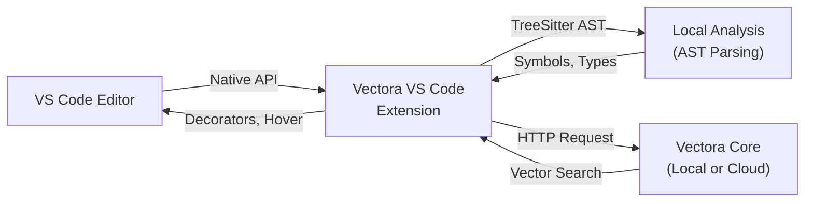



Vectora offers a native extension for VS Code that provides an integrated user interface, including a sidebar panel, custom commands, and inline hover information. Unlike the generic MCP protocol, this extension is built specifically for VS Code, leveraging its native APIs for maximum performance and seamless integration.

By using the official extension, you get a dedicated environment for codebase analysis without needing external protocols.

> [!IMPORTANT] > **VS Code Extension (Native) vs MCP Protocol (Generic)**:
>
> - **Extension**: Native UI, local performance, customizable hotkeys, and deep VS Code integration.
> - **MCP**: Generic protocol compatible with multiple IDEs (Claude Code, Cursor, Zed), but with a more limited feature set.

## Architecture: Native Extension vs MCP

The native extension communicates directly with the editor APIs while offloading heavy analysis to the Vectora Core.



## Feature Overview

The extension provides several entry points for interacting with your project's semantic index.

| Feature               | Description                            | Shortcut          |
| :-------------------- | :------------------------------------- | :---------------- |
| **Sidebar Panel**     | Search, index management, and metrics. | Cmd/Ctrl+Shift+V  |
| **Command Palette**   | Access all Vectora commands.           | Cmd/Ctrl+Shift+P  |
| **Hover Information** | Contextual info on mouse hover.        | Hover over symbol |
| **Find References**   | Semantic reference search.             | Cmd/Ctrl+Shift+H  |
| **Code Lens**         | Direct links above functions.          | Native VS Code    |
| **Quick Fix**         | Refactoring suggestions.               | Cmd/Ctrl+.        |

## Installation & Setup

Follow these steps to install the extension and connect it to your Vectora project.

### Via VS Code Marketplace (Recommended)

1. Open **VS Code**.
2. Go to the **Extensions** view (Cmd/Ctrl + Shift + X).
3. Search for `Vectora` (published by Kaffyn).
4. Click **Install** and grant file access when prompted.

### Verification

Open the Command Palette (Cmd/Ctrl+Shift+P) and type `Vectora: Show Metrics`. If the panel appears, the extension is active and connected.

## Initial Project Configuration

To enable Vectora features in your repository, you must initialize the project structure.

### Step 1: Initialize the Project

Run the following command in your project's terminal:

```bash
vectora init --name "My Project" --type codebase
```

This creates a `.vectora/config.json` file in your root directory.

### Step 2: Configure API Keys

The extension will request API keys on the first run. You have three ways to provide them:

- **VS Code Dialog**: Enter keys when prompted; they are stored encrypted in your settings.
- **Local .env File**: Create a `.env` file in the project root with `GEMINI_API_KEY` and `VOYAGE_API_KEY`.
- **Environment Variables**: Export the keys in your shell before launching VS Code.

## Detailed Interface Features

The extension enriches the standard VS Code experience with several specialized UI components.

### Sidebar Panel

The dedicated Vectora panel allows you to browse indexed files, perform live semantic searches, and monitor system health in real-time. It displays precision metrics, latency data, and the total number of indexed chunks.

### Inline Hover & Code Lens

When you hover over a function or variable, the extension displays semantic information, including similar symbols found elsewhere in the project. Code Lens links appear above function definitions, providing quick access to references, definitions, and tests.

## Step-by-Step Workflows

These workflows illustrate the typical developer experience when using the Vectora extension.

### Workflow: Rapid Context Search

**Scenario**: You need to understand how JWT validation is implemented.

1. Open the Command Palette and select **Vectora: Search Context**.
2. Type your question: "How are tokens validated?"
3. Results appear in real-time (typically <250ms), showing file paths, line numbers, and precision scores.
4. Clicking a result jumps directly to the code in the editor.

### Workflow: Semantic Impact Analysis

**Scenario**: You are refactoring a core function and need to see the semantic impact.

1. Place your cursor on the function name.
2. Trigger **Vectora: Analyze Dependencies** (Cmd/Ctrl+Alt+D).
3. The extension shows not just direct callers found by the AST, but also semantically similar implementations that might be affected by the logic change.

## Advanced Configuration

You can customize the extension behavior via the standard VS Code `settings.json` file.

```json
{
  "vectora.enabled": true,
  "vectora.namespace": "my-project",
  "vectora.autoIndex": true,
  "vectora.searchStrategy": "semantic",
  "vectora.maxResults": 10,
  "vectora.showCodeLens": true,
  "vectora.useLocalEmbeddings": false
}
```

### Excluding Directories

If you want to exclude certain folders from indexing (like `node_modules` or `dist`), update your `.vectora/config.json` file:

```json
{
  "indexing": {
    "exclude_patterns": ["node_modules/**", "dist/**", ".git/**", "build/**"]
  }
}
```

## Performance & Optimization

The extension is designed to be lightweight, typically using less than 150MB of memory even for large projects.

### Caching Strategy

Vectora automatically caches search results (for 24h), AST parsing data, and embeddings on disk. This means that subsequent searches for similar topics are significantly faster (up to 8x faster after the first hit).

### Local vs Cloud Embeddings

For maximum privacy, you can enable local embeddings. Note that this requires more CPU resources and is slower (~500ms per chunk) compared to the cloud-based Voyage AI integration.

## Troubleshooting

Common issues and their solutions are listed below.

- **Sidebar missing**: Ensure the extension is enabled in the Extensions view.
- **Command not found**: Verify that the `vectora` CLI is installed and available in your system PATH.
- **Slow performance**: Try changing the search strategy to `structural` in the settings or narrowing the `trustFolder` scope.

## External Linking

| Concept               | Resource                             | Link                                                                                   |
| --------------------- | ------------------------------------ | -------------------------------------------------------------------------------------- |
| **AST Parsing**       | Tree-sitter Official Documentation   | [tree-sitter.github.io/tree-sitter/](https://tree-sitter.github.io/tree-sitter/)       |
| **MCP**               | Model Context Protocol Specification | [modelcontextprotocol.io/specification](https://modelcontextprotocol.io/specification) |
| **MCP Go SDK**        | Go SDK for MCP (mark3labs)           | [github.com/mark3labs/mcp-go](https://github.com/mark3labs/mcp-go)                     |
| **Voyage AI**         | High-performance embeddings for RAG  | [www.voyageai.com/](https://www.voyageai.com/)                                         |
| **Voyage Embeddings** | Voyage Embeddings Documentation      | [docs.voyageai.com/docs/embeddings](https://docs.voyageai.com/docs/embeddings)         |
| **Voyage Reranker**   | Voyage Reranker API                  | [docs.voyageai.com/docs/reranker](https://docs.voyageai.com/docs/reranker)             |

---

_Part of the Vectora ecosystem_ · [Open Source (MIT)](https://github.com/Kaffyn/Vectora) · [Contributors](https://github.com/Kaffyn/Vectora/graphs/contributors)
