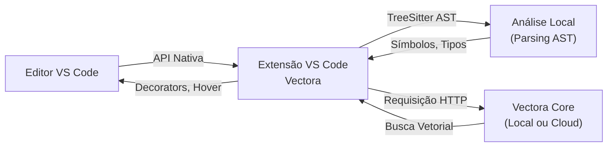



O Vectora oferece uma extensão nativa para o VS Code que fornece uma interface de usuário integrada, incluindo um painel na barra lateral, comandos personalizados e informações de hover inline. Diferente do protocolo genérico MCP, esta extensão é construída especificamente para o VS Code, aproveitando suas APIs nativas para máxima performance e integração perfeita.

Ao usar a extensão oficial, você obtém um ambiente dedicado para análise de base de código sem a necessidade de protocolos externos.

> [!IMPORTANT] > **Extensão VS Code (Nativa) vs Protocolo MCP (Genérico)**:
>
> - **Extensão**: UI nativa, performance local, teclas de atalho personalizáveis e integração profunda com o VS Code.
> - **MCP**: Protocolo genérico compatível com múltiplas IDEs (Claude Code, Cursor, Zed), mas com um conjunto de recursos mais limitado.

## Arquitetura: Extensão Nativa vs MCP

A extensão nativa se comunica diretamente com as APIs do editor enquanto delega a análise pesada para o Vectora Core.



## Visão Geral de Recursos

A extensão fornece vários pontos de entrada para interagir com o índice semântico do seu projeto.

| Recurso                  | Descrição                                  | Atalho           |
| :----------------------- | :----------------------------------------- | :--------------- |
| **Painel Lateral**       | Busca, gerenciamento de índice e métricas. | Cmd/Ctrl+Shift+V |
| **Paleta de Comandos**   | Acesse todos os comandos do Vectora.       | Cmd/Ctrl+Shift+P |
| **Informações de Hover** | Contexto ao passar o mouse sobre símbolos. | Hover em símbolo |
| **Find References**      | Busca semântica de referências.            | Cmd/Ctrl+Shift+H |
| **Code Lens**            | Links diretos acima de funções.            | Nativo VS Code   |
| **Quick Fix**            | Sugestões de refatoração.                  | Cmd/Ctrl+.       |

## Instalação & Configuração

Siga estes passos para instalar a extensão e conectá-la ao seu projeto Vectora.

### Via VS Code Marketplace (Recomendado)

1. Abra o **VS Code**.
2. Vá para a visualização de **Extensões** (Cmd/Ctrl + Shift + X).
3. Procure por `Vectora` (publicado pela Kaffyn).
4. Clique em **Install** e conceda acesso aos arquivos quando solicitado.

### Verificação

Abra a Paleta de Comandos (Cmd/Ctrl+Shift+P) e digite `Vectora: Show Metrics`. Se o painel aparecer, a extensão está ativa e conectada.

## Configuração Inicial do Projeto

Para habilitar os recursos do Vectora em seu repositório, você deve inicializar a estrutura do projeto.

### Passo 1: Inicializar o Projeto

Execute o seguinte comando no terminal do seu projeto:

```bash
vectora init --name "Meu Projeto" --type codebase
```

Isso cria um arquivo `.vectora/config.json` no seu diretório raiz.

### Passo 2: Configurar Chaves de API

A extensão solicitará as chaves de API na primeira execução. Você tem três formas de fornecê-las:

- **Diálogo do VS Code**: Insira as chaves quando solicitado; elas são armazenadas criptografadas nas suas configurações.
- **Arquivo .env Local**: Crie um arquivo `.env` na raiz do projeto com `GEMINI_API_KEY` e `VOYAGE_API_KEY`.
- **Variáveis de Ambiente**: Exporte as chaves no seu shell antes de iniciar o VS Code.

## Detalhes da Interface

A extensão enriquece a experiência padrão do VS Code com diversos componentes de interface especializados.

### Painel Lateral

O painel dedicado do Vectora permite que você navegue pelos arquivos indexados, realize buscas semânticas ao vivo e monitore a saúde do sistema em tempo real. Ele exibe métricas de precisão, dados de latência e o número total de chunks indexados.

### Hover Inline & Code Lens

Ao passar o mouse sobre uma função ou variável, a extensão exibe informações semânticas, incluindo símbolos semelhantes encontrados em outros lugares do projeto. Links de Code Lens aparecem acima das definições de função, fornecendo acesso rápido a referências, definições e testes.

## Workflows Passo a Passo

Estes fluxos ilustram a experiência típica do desenvolvedor ao usar a extensão do Vectora.

### Workflow: Busca Rápida de Contexto

**Cenário**: Você precisa entender como a validação JWT está implementada.

1. Abra a Paleta de Comandos e selecione **Vectora: Search Context**.
2. Digite sua pergunta: "Como os tokens são validados?"
3. Os resultados aparecem em tempo real (geralmente <250ms), mostrando caminhos de arquivos, números de linha e pontuações de precisão.
4. Clicar em um resultado salta diretamente para o código no editor.

### Workflow: Análise Semântica de Impacto

**Cenário**: Você está refatorando uma função principal e precisa ver o impacto semântico.

1. Coloque o cursor no nome da função.
2. Acione **Vectora: Analyze Dependencies** (Cmd/Ctrl+Alt+D).
3. A extensão mostra não apenas os chamadores diretos encontrados pela AST, mas também implementações semânticamente semelhantes que podem ser afetadas pela mudança de lógica.

## Configuração Avançada

Você pode personalizar o comportamento da extensão através do arquivo padrão `settings.json` do VS Code.

```json
{
  "vectora.enabled": true,
  "vectora.namespace": "meu-projeto",
  "vectora.autoIndex": true,
  "vectora.searchStrategy": "semantic",
  "vectora.maxResults": 10,
  "vectora.showCodeLens": true,
  "vectora.useLocalEmbeddings": false
}
```

### Excluindo Diretórios

Se você deseja excluir certas pastas da indexação (como `node_modules` ou `dist`), atualize seu arquivo `.vectora/config.json`:

```json
{
  "indexing": {
    "exclude_patterns": ["node_modules/**", "dist/**", ".git/**", "build/**"]
  }
}
```

## Performance & Otimização

A extensão é projetada para ser leve, tipicamente usando menos de 150MB de memória, mesmo para grandes projetos.

### Estratégia de Caching

O Vectora armazena automaticamente em cache os resultados de busca (por 24h), os dados de parsing da AST e os embeddings no disco. Isso significa que buscas subsequentes sobre tópicos semelhantes são significativamente mais rápidas (até 8x mais rápidas após o primeiro hit).

### Embeddings Locais vs Cloud

Para máxima privacidade, você pode habilitar os embeddings locais. Note que isso exige mais recursos de CPU e é mais lento (~500ms por chunk) em comparação com a integração baseada em nuvem da Voyage AI.

## Solução de Problemas

Problemas comuns e suas soluções estão listados abaixo.

- **Barra lateral ausente**: Certifique-se de que a extensão esteja habilitada na visualização de Extensões.
- **Comando não encontrado**: Verifique se o CLI do `vectora` está instalado e disponível no PATH do seu sistema.
- **Performance lenta**: Tente mudar a estratégia de busca para `structural` nas configurações ou restringir o escopo da `trustFolder`.

## External Linking

| Concept               | Resource                             | Link                                                                                   |
| --------------------- | ------------------------------------ | -------------------------------------------------------------------------------------- |
| **AST Parsing**       | Tree-sitter Official Documentation   | [tree-sitter.github.io/tree-sitter/](https://tree-sitter.github.io/tree-sitter/)       |
| **MCP**               | Model Context Protocol Specification | [modelcontextprotocol.io/specification](https://modelcontextprotocol.io/specification) |
| **MCP Go SDK**        | Go SDK for MCP (mark3labs)           | [github.com/mark3labs/mcp-go](https://github.com/mark3labs/mcp-go)                     |
| **Voyage AI**         | High-performance embeddings for RAG  | [www.voyageai.com/](https://www.voyageai.com/)                                         |
| **Voyage Embeddings** | Voyage Embeddings Documentation      | [docs.voyageai.com/docs/embeddings](https://docs.voyageai.com/docs/embeddings)         |
| **Voyage Reranker**   | Voyage Reranker API                  | [docs.voyageai.com/docs/reranker](https://docs.voyageai.com/docs/reranker)             |

---

_Parte do ecossistema Vectora_ · [Open Source (MIT)](https://github.com/Kaffyn/Vectora) · [Contribuidores](https://github.com/Kaffyn/Vectora/graphs/contributors)
