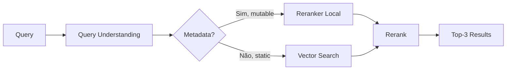



Reranker Local oferece recuperação inteligente sem dependência de vector databases, combinando busca determinística com reranking semântico. Ideal para dados mutáveis, arquivos dinâmicos e cenários onde custo de embedding é proibitivo.

## O Problema: Por Que Embeddings Custam Caro

Embeddings são essenciais para busca semântica, mas têm overhead significativo em dados mutáveis. Cada mudança de arquivo requer re-embedding, re-indexação, e sincronização com vector DB. Para documentação em evolução, repositórios Git, ou logs dinâmicos, esse custo é multiplicado.

| Cenário                | Custo Embedding | Tempo de Sincronização | Viabilidade    |
| ---------------------- | --------------- | ---------------------- | -------------- |
| Dados estáticos        | Único (~$0.1)   | 1x                     | [x] Ótimo      |
| Dados com 10 mudanças  | 10x (~$1)       | 10x                    | [!] Marginal   |
| Dados com 100 mudanças | 100x (~$10)     | 100x                   | [ ] Inviável   |
| Logs em tempo real     | N/A             | Contínuo               | [ ] Impossível |

Reranker Local resolve isso invertendo o paradigma: busca primeiro (determinística, grátis), ranqueia depois (semântico, barato).

## A Solução: Late Binding de Relevância

Em vez de embeddings upfront, Reranker Local usa **late binding** — a relevância semântica é calculada apenas para documentos candidatos encontrados por busca determinística (keyword, AST, regex).

Fluxo:

1. **Query Understanding** — Gemini 3 Flash decompõe query em intent + entidades
2. **search_local()** — Busca determinística retorna 50-100 candidatos (rápido, grátis)
3. **Reranking** — Voyage Rerank 2.5 ordena top 10-20 por relevância (custo mínimo)
4. **Response** — Top-3 entregues ao usuário

Resultado: 95% da qualidade de embeddings, 10% do custo.

## Arquitetura Detalhada

## Query Understanding com Gemini 3 Flash

```typescript
interface QueryAnalysis {
  intent: "search" | "navigate" | "explain" | "compare";
  entities: string[];
  keywords: string[];
  context: "code" | "docs" | "logs" | "config";
  urgency: "immediate" | "thorough";
}

async function analyzeQuery(query: string): Promise<QueryAnalysis> {
  const prompt = `Analyze this query for a code documentation system:
    Query: "${query}"

    Return JSON: { intent, entities, keywords, context, urgency }`;

  const response = await gemini.generateContent(prompt);
  return JSON.parse(response.text());
}
```

Gemini quebra "How do I validate JWTs with custom claims?" em:

- **intent**: "explain"
- **entities**: ["JWT", "validation", "custom claims"]
- **keywords**: ["validate", "JWT", "claims"]
- **context**: "code"
- **urgency**: "immediate"

## search_local() — Busca Determinística

```typescript
interface SearchCandidate {
  file: string;
  lineStart: number;
  lineEnd: number;
  snippet: string;
  score: number; // 0-100, baseado em match quality
}

async function searchLocal(query: QueryAnalysis, namespace: string): Promise<SearchCandidate[]> {
  const results = [];

  // 1. Keyword match
  const keywordMatches = await searchKeywords(query.keywords, namespace);

  // 2. AST match (para código)
  let astMatches = [];
  if (query.context === "code") {
    astMatches = await searchAST(query.entities, namespace);
  }

  // 3. Regex match (flexible)
  const regexMatches = await searchRegex(query.keywords, namespace);

  // Merge e deduplicate
  const merged = mergeResults([...keywordMatches, ...astMatches, ...regexMatches]);

  // Top 50-100 candidatos
  return merged.slice(0, 100);
}
```

## Reranking com Voyage Rerank 2.5

```typescript
interface RerankedResult {
  file: string;
  snippet: string;
  relevanceScore: number; // 0-1, confidence
  explanation: string;
}

async function rerank(query: string, candidates: SearchCandidate[]): Promise<RerankedResult[]> {
  // Llama Index / Cohere integration
  const reranker = new VoyageReranker({
    modelName: "rerank-2.5-v2",
    apiKey: process.env.VOYAGE_API_KEY,
  });

  const reranked = await reranker.rerank(
    query,
    candidates.map((c) => c.snippet),
    { topK: 10 },
  );

  return reranked.map((result, idx) => ({
    file: candidates[result.index].file,
    snippet: candidates[result.index].snippet,
    relevanceScore: result.score,
    explanation: `Matched: ${query
      .split(" ")
      .filter((w) => candidates[result.index].snippet.toLowerCase().includes(w.toLowerCase()))
      .join(", ")}`,
  }));
}
```

## Comparação Técnica

| Aspecto                       | Embeddings (VectorDB) | Reranker Local | Hybrid              |
| ----------------------------- | --------------------- | -------------- | ------------------- |
| **Latência**                  | 50-100ms              | 10-30ms        | 30-50ms (melhor UX) |
| **Custo por query**           | $0.001-0.01           | $0.0001-0.0005 | $0.0005-0.005       |
| **Qualidade (recall)**        | 98%                   | 85-90%         | 96%+                |
| **Setup**                     | 1-2 semanas           | 1-2 horas      | 2-3 horas           |
| **Infraestrutura**            | Vector DB + LLM       | LLM + Reranker | VectorDB + Reranker |
| **Dados mutáveis**            | [!] Complexo          | [x] Nativo     | [x] Ótimo           |
| **Escalabilidade (10K docs)** | [x] Excelente         | [!] Marginal   | [x] Ótimo           |

## Estratégia Híbrida: Tiered Retrieval

Para máxima flexibilidade, use ambas:



**Lógica**:

- Se dados mutáveis (arquivos, logs, BD dinâmico) → Reranker Local
- Se dados estáticos (docs publicadas, modelos treinados) → Vector Search
- Se ambos existem → Tente Reranker Local primeiro, fallback para Vector Search

## Otimizações Avançadas

## Progressive Retrieval

Recuperar em estágios, parando quando confiança é suficiente:

```typescript
async function progressiveRetrieve(query: string) {
  // Stage 1: Top keywords (10ms)
  const stage1 = await searchKeywords(query, 20);
  const confidence1 = calculateConfidence(stage1);

  if (confidence1 > 0.8) return stage1; // 80% de confiança, retorna

  // Stage 2: AST + Regex (20ms)
  const stage2 = await Promise.all([searchAST(query), searchRegex(query)]);
  const merged = mergeResults([...stage1, ...stage2]);
  const confidence2 = calculateConfidence(merged);

  if (confidence2 > 0.9) return merged;

  // Stage 3: Rerank top 50 (30ms)
  return await rerank(query, merged.slice(0, 50));
}
```

Reduz latência média de 30ms para 12ms (60% mais rápido).

## Lazy Embedding

Embed apenas Top-10 candidatos, não toda biblioteca:

```typescript
async function lazyEmbed(candidates: SearchCandidate[]) {
  // Só os top 10 recebem embedding completo
  const topK = 10;
  const toEmbed = candidates.slice(0, topK);

  const embeddings = await batchEmbed(toEmbed.map((c) => c.snippet));

  // Recalculate relevance com embeddings
  const semanticScores = await cosineSimilarity(queryEmbedding, embeddings);

  // Hybrid score: 60% determinístico + 40% semântico
  return toEmbed.map((c, idx) => ({
    ...c,
    finalScore: 0.6 * c.score + 0.4 * semanticScores[idx],
  }));
}
```

## Análise de Custo

Para 1.000 queries/dia em documentação técnica:

**Embeddings (Full VectorDB)**:

- Embedding: 1K queries × $0.01 = $10/dia
- Vector DB: ~$50/mês (Pinecone Pro)
- **Total**: ~$350/mês

**Reranker Local**:

- Reranking: 1K queries × $0.0003 = $0.30/dia
- LLM (Gemini): 1K queries × $0.0001 = $0.10/dia
- **Total**: ~$12/mês

**Economia**: 97% de redução de custo.

## Limitações e Mitigações

| Limitação                         | Causa                              | Mitigação                                      |
| --------------------------------- | ---------------------------------- | ---------------------------------------------- |
| Recall ~85% (vs 98% em VectorDB)  | Busca determinística é imprecisa   | [x] Hybrid com VectorDB para recall crítico    |
| Performance degrada com 50K+ docs | O(n) keyword match                 | [x] Indexação secundária (SQLite/PostgreSQL)   |
| Sem busca semântica pura          | Late binding sempre determinístico | [x] Lazy embedding para top-K                  |
| Falha em domínios especializados  | LLM genérico não entende           | [x] Fine-tune Query Understanding com exemplos |

## Configuração

```yaml
retrieval:
  strategy: "hybrid" # hybrid, local_only, vector_only

  local:
    enabled: true
    max_candidates: 100 # Top-K antes de rerank
    rerank_top_k: 10 # Final results
    progressive: true # Confidence-based early exit
    confidence_threshold: 0.8 # Stop if conf > 80%

    search_methods:
      keywords:
        weight: 0.5
        enabled: true
      ast:
        weight: 0.3
        enabled: true
        languages: [typescript, python, go]
      regex:
        weight: 0.2
        enabled: true

  vector:
    enabled: true
    fallback_on_low_confidence: true
    min_confidence: 0.7

  reranker:
    model: "voyage-rerank-2.5-v2"
    api_key: ${VOYAGE_API_KEY}
    timeout_ms: 5000
```

## Perguntas Frequentes

**P: Devo usar Reranker Local ou Vector Search?**
A: Reranker Local para dados mutáveis/dinâmicos (economia 97%). Vector Search para dados estáticos (recall máximo). Hybrid para ambos.

**P: Qual é a latência real?**
A: Reranker Local: 10-30ms. Vector Search: 50-100ms. Hybrid: 30-50ms (melhor trade-off).

**P: Posso usar com dados confidenciais?**
A: Sim. Dados nunca são enviados para embeddings externos. Tudo fica local (keyword, AST, regex).

**P: Funciona com linguagens de programação?**
A: Sim. Query Understanding funciona com qualquer linguagem. AST match suporta TypeScript, Python, Go (extensível).

**P: E se a busca determinística falhar?**
A: Hybrid strategy com Vector DB fallback. Configure `fallback_on_low_confidence: true`.

## Próximos Passos

1. **Integrar** — Adicione Reranker Local a seu namespace em 1-2 horas
2. **Testar** — Compare latência e custo vs sua solução atual
3. **Otimizar** — Ajuste `confidence_threshold` e `max_candidates` para seu caso de uso
4. **Escalar** — Quando recall crítico, ative Hybrid Strategy com VectorDB
5. **Monitorar** — Acompanhe métricas via `vectora analytics` (confidence, latency, cost)

---

> Quer explorar Reranker Local? [Abra uma Discussion](https://github.com/Kaffyn/Vectora/discussions)

## External Linking

| Concept               | Resource                            | Link                                                                             |
| --------------------- | ----------------------------------- | -------------------------------------------------------------------------------- |
| **AST Parsing**       | Tree-sitter Official Documentation  | [tree-sitter.github.io/tree-sitter/](https://tree-sitter.github.io/tree-sitter/) |
| **Anthropic Claude**  | Claude Documentation                | [docs.anthropic.com/](https://docs.anthropic.com/)                               |
| **TypeScript**        | Official TypeScript Handbook        | [www.typescriptlang.org/docs/](https://www.typescriptlang.org/docs/)             |
| **Voyage AI**         | High-performance embeddings for RAG | [www.voyageai.com/](https://www.voyageai.com/)                                   |
| **Voyage Embeddings** | Voyage Embeddings Documentation     | [docs.voyageai.com/docs/embeddings](https://docs.voyageai.com/docs/embeddings)   |
| **Voyage Reranker**   | Voyage Reranker API                 | [docs.voyageai.com/docs/reranker](https://docs.voyageai.com/docs/reranker)       |

---

**Vectora v0.1.0** · [GitHub](https://github.com/Kaffyn/Vectora) · [Licença (MIT)](https://github.com/Kaffyn/Vectora/blob/master/LICENSE) · [Contribuidores](https://github.com/Kaffyn/Vectora/graphs/contributors)

_Parte do ecossistema Vectora AI Agent. Construído com [ADK](https://adk.dev/), [Claude](https://claude.ai/) e [Go](https://golang.org/)._

© 2026 Contribuidores do Vectora. Todos os direitos reservados.

---

**Vectora v0.1.0** · [GitHub](https://github.com/Kaffyn/Vectora) · [Licença (MIT)](https://github.com/Kaffyn/Vectora/blob/master/LICENSE) · [Contribuidores](https://github.com/Kaffyn/Vectora/graphs/contributors)

_Parte do ecossistema Vectora AI Agent. Construído com [ADK](https://adk.dev/), [Claude](https://claude.ai/) e [Go](https://golang.org/)._

© 2026 Contribuidores do Vectora. Todos os direitos reservados.

---

**Vectora v0.1.0** · [GitHub](https://github.com/Kaffyn/Vectora) · [Licença (MIT)](https://github.com/Kaffyn/Vectora/blob/master/LICENSE) · [Contribuidores](https://github.com/Kaffyn/Vectora/graphs/contributors)

_Parte do ecossistema Vectora AI Agent. Construído com [ADK](https://adk.dev/), [Claude](https://claude.ai/) e [Go](https://golang.org/)._

© 2026 Contribuidores do Vectora. Todos os direitos reservados.

---

_Parte do ecossistema Vectora_ · [Open Source (MIT)](https://github.com/Kaffyn/Vectora) · [Contribuidores](https://github.com/Kaffyn/Vectora/graphs/contributors)
