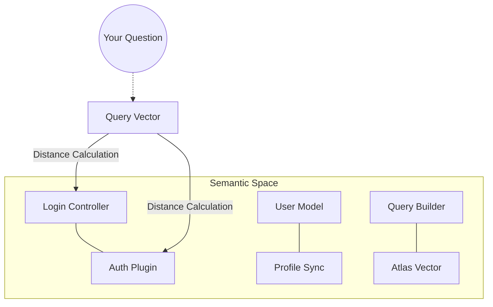



## What is Vector Search?

**Vector Search** is the technology that allows finding information not by exact keywords (like in SQL `LIKE %term%`), but by **semantic meaning**.

Imagine you want to find where your code handles "subscription cancellation".

- **Traditional Search**: Looks for `cancel`, `subscription`, `unsub`. If the programmer used `deactivateAccount`, traditional search fails.
- **Vector Search**: Understands that "deactivate account" and "cancel subscription" are in the same semantic universe of service termination and finds the result.

## How It Works: From Code to Vector

Vector search transforms text or code into a list of numbers (a **vector**) representing its position in a high-dimensional "thought space".

## 1. Embedding (The Coordinate)

[Voyage 4](/concepts/embeddings/) processes a snippet of code and generates a vector of 1,536 numbers.

- Code about "Auth" will have high values in the security dimension.
- Code about "Database" will have high values in the persistence dimension.

## 2. Vector Space

Think of a 3D map (though in Vectora there are 1,536 dimensions). Similar code stays **physically close** on the map.

## Similarity Metrics

To know how "close" a query is to a piece of code in Vectora, we use **Cosine Similarity**.

| Metric                 | How It Works                                    | Why It Matters                                                                      |
| ---------------------- | ----------------------------------------------- | ----------------------------------------------------------------------------------- |
| **Cosine Similarity**  | Measures the angle between two vectors.         | Ideal for comparing snippets of different lengths (short phrase vs. long function). |
| **Euclidean Distance** | Measures straight-line distance between points. | Useful for pure numerical data, but less precise for natural language/code.         |
| **Dot Product**        | Direct multiplication of vectors.               | Extremely fast on modern hardware, used internally by MongoDB Atlas.                |

## The HNSW Algorithm

Vectora uses **HNSW (Hierarchical Navigable Small World)** in MongoDB Atlas. It is the "State of the Art" in approximate nearest neighbor search (ANN).

- **The Problem**: Comparing your query with 1 million vectors one by one is slow (O(N)).
- **The Solution (HNSW)**: Creates a "layered" structure like a highway system.
  1. The top layer has few points (main highways).
  2. The algorithm jumps quickly between distant points.
  3. As it gets closer, it moves down to lower layers (local streets) with more detail.
- **Performance in Vectora**: Finds the top 20 results in <50ms across massive databases.

## Vector Search vs. Full-Text Search in Atlas

MongoDB Atlas offers both. Here is the difference:

| Feature         | Full-Text (Lucene)                  | Vector (HNSW)                        |
| --------------- | ----------------------------------- | ------------------------------------ |
| **Basis**       | Words/Tokens                        | Embeddings                           |
| **Precision**   | High for exact names (ex: `UserID`) | High for concepts (ex: `validation`) |
| **Flexibility** | Rigid with typos                    | Resistant to synonyms and errors     |
| **Context**     | Ignores intent                      | Prioritizes semantics                |

**Vectora's Strategy**: We use **Hybrid Search** where applicable, but the driving force is vector search refined by the [Reranker](/concepts/reranker/).

## Vector Search FAQ

**Q: Why does vector search sometimes bring results that don't contain the text I typed?**
A: Because it understood the **intent**. If you search for "security", it will bring results about `Bcrypt`, `JWT`, and `Salting`, even if the word "security" doesn't appear in the code.

**Q: Does Vectora understand code in any language?**
A: Yes, thanks to Voyage 4, the semantic structures of loops, conditionals, and type declarations are similar in almost all modern languages.

**Q: How do namespaces affect search?**
A: Vectora applies a **metadata filter** ("Pre-filtering") before the vector search. This ensures that the HNSW algorithm only crawls vectors belonging to your authorized project.

## External Linking

| Concept               | Resource                                                 | Link                                                                                                       |
| --------------------- | -------------------------------------------------------- | ---------------------------------------------------------------------------------------------------------- |
| **MongoDB Atlas**     | Atlas Vector Search Documentation                        | [www.mongodb.com/docs/atlas/atlas-vector-search/](https://www.mongodb.com/docs/atlas/atlas-vector-search/) |
| **Voyage AI**         | High-performance embeddings for RAG                      | [www.voyageai.com/](https://www.voyageai.com/)                                                             |
| **Voyage Embeddings** | Voyage Embeddings Documentation                          | [docs.voyageai.com/docs/embeddings](https://docs.voyageai.com/docs/embeddings)                             |
| **Voyage Reranker**   | Voyage Reranker API                                      | [docs.voyageai.com/docs/reranker](https://docs.voyageai.com/docs/reranker)                                 |
| **HNSW**              | Efficient and robust approximate nearest neighbor search | [arxiv.org/abs/1603.09320](https://arxiv.org/abs/1603.09320)                                               |
| **Anthropic Claude**  | Claude Documentation                                     | [docs.anthropic.com/](https://docs.anthropic.com/)                                                         |

---

> **Phrase to remember**:
> _"In traditional search, you type words. In Vectora's vector search, you express intentions."_

---

**Vectora v0.1.0** · [GitHub](https://github.com/Kaffyn/Vectora) · [License (MIT)](https://github.com/Kaffyn/Vectora/blob/master/LICENSE) · [Contributors](https://github.com/Kaffyn/Vectora/graphs/contributors)

_Part of the Vectora AI Agent ecosystem. Built with [ADK](https://adk.dev/), [Claude](https://claude.ai/) and [Go](https://golang.org/)._

© 2026 Vectora Contributors. All rights reserved.

---

_Part of the Vectora ecosystem_ · [Open Source (MIT)](https://github.com/Kaffyn/Vectora) · [Contributors](https://github.com/Kaffyn/Vectora/graphs/contributors)
