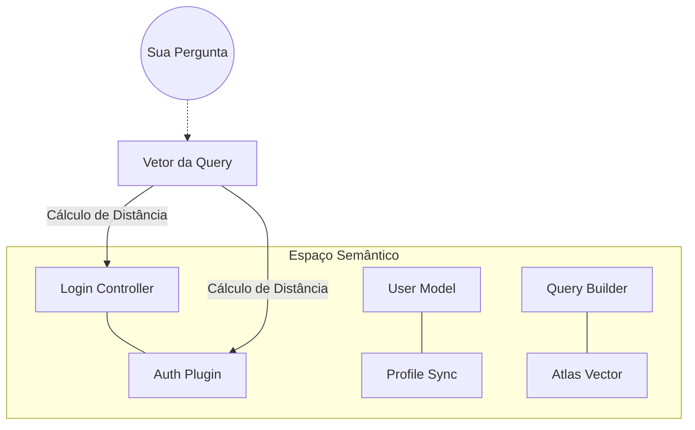



## O Que é Busca Vetorial?

A **Busca Vetorial** (ou Vector Search) é a tecnologia que permite encontrar informações não por palavras-chave exatas (como no SQL `LIKE %termino%`), mas pelo **significado semântico**.

Imagine que você quer encontrar no seu código onde o sistema lida com "cancelamento de assinatura".

- **Busca Tradicional**: Procura por `cancel`, `subscription`, `unsub`. Se o programador usou `deactivateAccount`, a busca tradicional falha.
- **Busca Vetorial**: Entende que "deactivate account" e "cancel subscription" estão no mesmo universo semântico de finalização de serviço e encontra o resultado.

## Como Funciona: Do Código ao Vetor

A busca vetorial transforma texto ou código em uma lista de números (um **vetor**) que representa sua posição em um "espaço de pensamento" de alta dimensionalidade.

## 1. Embedding (A Coordenada)

O [Voyage 4](/concepts/embeddings/) processa um trecho de código e gera um vetor de 1.536 números.

- Código sobre "Auth" terá números altos na dimensão de segurança.
- Código sobre "Database" terá números altos na dimensão de persistência.

## 2. Espaço Vetorial

Pense em um mapa 3D (embora no Vectora sejam 1.536 dimensões). Código similar fica **fisicamente próximo** no mapa.

## Métricas de Similaridade

Para saber o quão "perto" uma query está de um pedaço de código no Vectora, usamos o **Cosine Similarity** (Similaridade de Cosseno).

| Métrica                | Como Funciona                                   | Por que importa                                                                              |
| ---------------------- | ----------------------------------------------- | -------------------------------------------------------------------------------------------- |
| **Cosine Similarity**  | Mede o ângulo entre dois vetores.               | É ideal para comparar trechos de tamanhos diferentes (uma frase curta vs. uma função longa). |
| **Euclidean Distance** | Mede a distância em linha reta entre os pontos. | Útil em dados numéricos puros, mas menos precisa para linguagem natural/código.              |
| **Dot Product**        | Multiplicação direta dos vetores.               | Extremamente rápida em hardware moderno, usada internamente pelo MongoDB Atlas.              |

## O Algoritmo HNSW

O Vectora usa o **HNSW (Hierarchical Navigable Small World)** no MongoDB Atlas. É o "Estado da Arte" em busca de vizinhos mais próximos (ANN - Approximate Nearest Neighbors).

- **O Problema**: Comparar sua query com 1 milhão de vetores um por um é lento (O(N)).
- **A Solução (HNSW)**: Cria uma estrutura de "camadas" como um sistema de rodovias.
  1. A camada superior tem poucos pontos (rodovias principais).
  2. O algoritmo pula rapidamente entre pontos distantes.
  3. Conforme chega perto, ele desce para camadas inferiores (ruas locais) com mais detalhes.
- **Performance no Vectora**: Encontra os 20 melhores resultados em <50ms em base de dados massivas.

## Busca Vetorial vs. Full-Text Search no Atlas

O MongoDB Atlas oferece ambos. Aqui está a diferença:

| Característica    | Full-Text (Lucene)                    | Vector (HNSW)                         |
| ----------------- | ------------------------------------- | ------------------------------------- |
| **Base**          | Palavras/Tokens                       | Embeddings                            |
| **Precisão**      | Alta para nomes exatos (ex: `UserID`) | Alta para conceitos (ex: `validação`) |
| **Flexibilidade** | Rígida a erros de digitação           | Resistente a sinônimos e erros        |
| **Contexto**      | Ignora a intenção                     | Prioriza a semântica                  |

**A Estratégia do Vectora**: Nós usamos **Hybrid Search** onde aplicável, mas a força motriz é a busca vetorial refinada pelo [Reranker](/concepts/reranker/).

## FAQ de Busca Vetorial

**P: Por que a busca vetorial às vezes traz resultados que não contêm o texto que eu digitei?**
R: Porque ela entendeu a **intenção**. Se você busca "segurança", ela trará resultados sobre `Bcrypt`, `JWT` e `Salting`, mesmo que a palavra "segurança" não apareça no código.

**P: O Vectora entende código de qualquer linguagem?**
R: Sim, graças ao Voyage 4, as estruturas semânticas de loops, condicionais e declarações de tipos são similares em quase todas as linguagens modernas.

**P: Como os namespaces afetam a busca?**
R: O Vectora aplica um **filtro de metadados** ("Pre-filtering") antes da busca vetorial. Isso garante que o algoritmo HNSW só percorra os vetores que pertencem ao seu projeto autorizado.

## External Linking

| Concept               | Resource                                                 | Link                                                                                                       |
| --------------------- | -------------------------------------------------------- | ---------------------------------------------------------------------------------------------------------- |
| **MongoDB Atlas**     | Atlas Vector Search Documentation                        | [www.mongodb.com/docs/atlas/atlas-vector-search/](https://www.mongodb.com/docs/atlas/atlas-vector-search/) |
| **Voyage AI**         | High-performance embeddings for RAG                      | [www.voyageai.com/](https://www.voyageai.com/)                                                             |
| **Voyage Embeddings** | Voyage Embeddings Documentation                          | [docs.voyageai.com/docs/embeddings](https://docs.voyageai.com/docs/embeddings)                             |
| **Voyage Reranker**   | Voyage Reranker API                                      | [docs.voyageai.com/docs/reranker](https://docs.voyageai.com/docs/reranker)                                 |
| **HNSW**              | Efficient and robust approximate nearest neighbor search | [arxiv.org/abs/1603.09320](https://arxiv.org/abs/1603.09320)                                               |
| **Anthropic Claude**  | Claude Documentation                                     | [docs.anthropic.com/](https://docs.anthropic.com/)                                                         |

---

> **Frase para lembrar**:
> _"Na busca tradicional você digita palavras. Na busca vetorial do Vectora, você expressa intenções."_

---

**Vectora v0.1.0** · [GitHub](https://github.com/Kaffyn/Vectora) · [Licença (MIT)](https://github.com/Kaffyn/Vectora/blob/master/LICENSE) · [Contribuidores](https://github.com/Kaffyn/Vectora/graphs/contributors)

_Parte do ecossistema Vectora AI Agent. Construído com [ADK](https://adk.dev/), [Claude](https://claude.ai/) e [Go](https://golang.org/)._

© 2026 Contribuidores do Vectora. Todos os direitos reservados.

---

_Parte do ecossistema Vectora_ · [Open Source (MIT)](https://github.com/Kaffyn/Vectora) · [Contribuidores](https://github.com/Kaffyn/Vectora/graphs/contributors)
